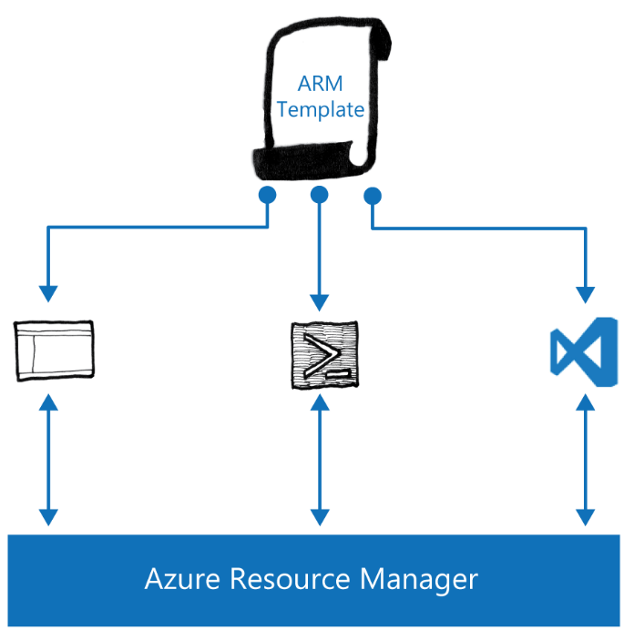

# Deploying Azure Resource Manager Templates

You can deploy an Azure Resource Manager template by using one of several different methods, which include:

- Azure Stack Portal

- Azure PowerShell

- Azure CLI

- Visual Studio

- REST API call

This topic covers deployment using the first four options. Deployment through a REST API call is beyond the scope of this course. For more details on how to use the REST API to deploy an ARM template, refer to the following website: <https://aka.ms/moc-10995A-pg051>.

## Passing Parameter Values to a Template Deployment

As mentioned earlier, you can pass parameters to ARM templates at deployment time. There are three ways of passing parameters to an Azure Resource Manager template:

1. **Inline parameters:** These are passed as Key/Value pairs. The Key is the name of the parameter and the Value is the value to pass to the parameter. When you use PowerShell to pass inline parameters, you must use a PowerShell hashtable. When you use Azure CLI, you must encode them as JSON.

2. **Parameters file:** This is a specially crafted JSON file that contains the values for the required parameters. Note that the size of a parameters file cannot exceed 64 KB. You can store a parameters file locally on your machine or source it through a URI.

3. **Mix of inline parameters and parameters file:** When you use a mix of the two options, there are certain precedent rules that you must take into consideration. If you are using a parameters file that is sourced from a URI, then all inline parameters are ignored. If you are using a parameters file that is stored locally, then parameters that are passed inline will override values in the parameters file.

When you use a parameter file, we recommended that you do not store sensitive information, such as passwords, in the file. We recommend that you use the Key Vault feature to store sensitive information. For more information on how to incorporate Key Vault into your parameters file, refer to the following website: <https://aka.ms/moc-10995A-pg052>.

**Note:** Key Vault is available in Azure Stack and will be detailed in Module 7.