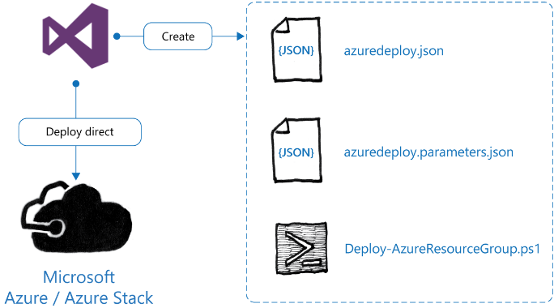

# Visual Studio and Azure Resource Manager Templates

You can connect Visual Studio to Azure Stack and deploy resources directly into a subscription. In addition to deploying applications, Visual Studio can also deploy Azure Resource Manager templates.

Microsoft offers various versions of Visual Studio. However, this topic covers functions available with the free to use version, Visual Studio Community. You can this version to create and deploy ARM templates into Azure Stack and Azure. To use the Visual Studio Community edition, you need a Microsoft Account.

When using Visual Studio to create your Azure Resource Manager Templates, you can use the Intellisense feature to help you create your templates. Intellisense can show you the possible functions and syntax for a specific section. This can help minimize errors in the creation of ARM templates.

Another feature of Visual Studio is the validation of the Azure Resource Manager template. Visual Studio can show you if you are missing any elements such as a trailing comma on a line of JSON or if the entered text is valid or not. Some sections might show up as questionable because you might be referencing variables to populate a resource property. Visual Studio will highlight this for you but will not prevent you from deploying your ARM template.

When you create an Azure Resource Manager Template in Visual Studio, you can choose to store the resultant files in a code repository such as Visual Studio Team Services or GitHub. After you store a template in a centralized location, it is then available for other people to use and collaborate on.

There are numerous files generated for an ARM Template with Visual Studio. However, the key files are:

- azuredeploy.json: This file contains the ARM template that is to be deployed.

- azuredeploy.parameters.json: This file contains any parameters that need to be passed to ARM to deploy to the template.

- Deploy-AzureResourceGroup.ps1: This is a pre-created Windows PowerShell file that can be used to deploy the ARM template.

To aid in the development of Azure Resource Manager templates, Microsoft has created starter templates in Visual Studio. By using Visual Studio, you also can connect directly to the publicly available Azure Resource Manager templates on GitHub. These templates have been created by Microsoft and by the technical community.