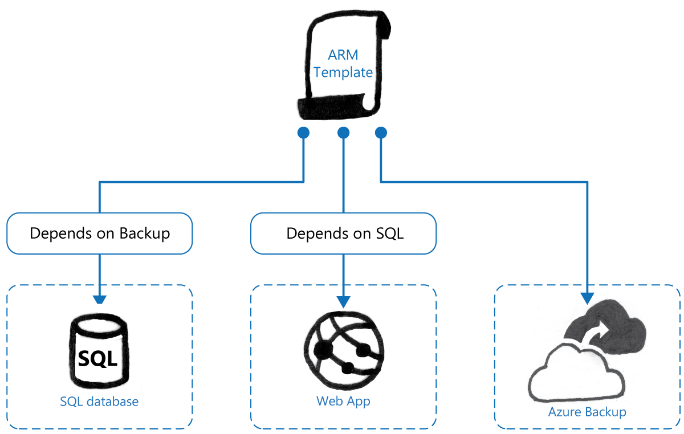

# Azure Resource Manager Templates (ARM)

In this lesson, you will learn about Azure Resource Manager (ARM) templates. All deployments within Azure Stack and Azure are performed by using Azure Resource Manager templates, even for Marketplace items such as a virtual machine. By learning how to create your own ARM templates, you can ensure that deployments to Azure Stack meet your requirements.

After completing this module, you will be able to:

- Understand what an Azure Resource Manager Template is.

- Understand how to use Azure Resource Manager templates.

- Understand how Visual Studio, ARM templates, and Azure Stack work together.

- Understand how to deploy ARM templates.

## What is an Azure Resource Manager (ARM) Template?

You have learned about certain components of Azure Resource Manager and how to use them. Azure Resource Manager templates are the key to creating consistent deployments of resources.

Some of the key features of Azure Resource Manager templates are:

- Declarative: Azure Resource Manager templates use a declarative syntax, and not imperative syntax. This means you declare what resources you want and what configuration you want to apply to them. You do not need to tell ARM how to apply the configuration.

- Idempotent: You can deploy the template repeatedly with the same result.

- Multi-service: You can add all services in Azure and Azure Stack that support Azure Resource Manager templates to a single Azure Resource Manager Template. For example, a single Azure Resource Manager Template could deploy a virtual network, storage accounts, and virtual machines, each of which use a different service.

- Multi-region: As discussed earlier in this course, a resource group can contain resources that reside in different regions. Therefore, in your template, you can specify to which region you would like to deploy the resource.

- Extensible: The architecture of the ARM template is extensible. As additional services are deployed into Azure Stack, you can expand your ARM template to include these services.

You can deploy an Azure Resource Manager Template by using the Azure Stack Portal, Azure PowerShell, or Azure CLI. You can call the API directly too. When you deploy resources by using an Azure Resource Manager template, the resources are deployed into a preexisting resource group and you must deploy all resources into that resource group. An Azure Resource Manager template cannot deploy resources into more than one resource group.