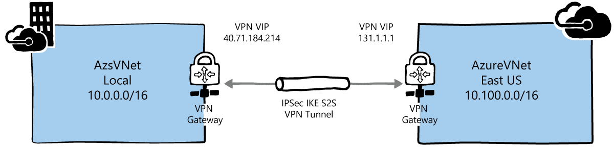

# Connect Azure Stack to Azure using VPN

This topic shows you how to create a site-to-site VPN to connect a virtual network in Azure Stack to a virtual network in Azure.

The following diagram shows what the connection configuration should look like when you’re done:

## Before you begin

To complete the connection configuration, make sure you have the following items before you begin:  

- An Azure Stack integrated systems (multi-node) deployment that is directly connected to the Internet. This means that your External Public IP Address range must be directly reachable from the public Internet.

- A valid Azure subscription. If you don’t have an Azure subscription, you can create a free Azure account here: <https://azure.microsoft.com/free/?b=17.06>.

## Network example values table

The network example values table shows the sample values that are used in this article. You can use these values or you can refer to them to better understand the examples in this topic.

||Azure Stack|Azure|
|---------|---------|---------|
|Virtual network name|Azs-VNet|AzureVNet|
|Virtual network address space|10.1.0.0/16|10.100.0.0/16|
|Subnet name|FrontEnd|FrontEnd|
|Subnet address range|10.1.0.0/24|10.100.0.0/24|
|Gateway subnet|10.1.1.0/24|10.100.1.0/24|