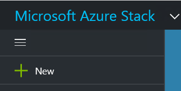
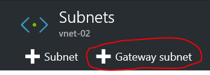

# Create the Network Resources in Azure Stack

Next you create the network resources in Azure Stack.

## Sign in as a user

A service administrator can sign in as a user to test the plans, offers, and subscriptions that their users might use. If you don't already have one, create a user account before you sign in: <https://docs.microsoft.com/en-us/azure/azure-stack/azure-stack-add-new-user-aad>.

## Create the virtual network and VM subnet

1. Use a user account to sign in to the user portal.

2. In the user portal, select **New**.

    

3. Go to **Marketplace**, and then select **Networking**.

4. Select **Virtual network**.

5. For **Name**, **Address space**, **Subnet name**, and **Subnet address range**, use the values from the network configuration table.

6. In **Subscription**, the subscription that you created earlier appears.

7. For **Resource Group**, you can either create a resource group or if you already have one, select **Use existing**.

8. Verify the default location.

9. Select **Pin to dashboard**.

10. Select **Create**.

## Create the gateway subnet

1. On the dashboard, open the Azs-VNet virtual network resource you created.

2. On the **Settings** section, select **Subnets**.

3. To add a gateway subnet to the virtual network, select **Gateway Subnet**.

    

4. By default, the subnet name is set to **GatewaySubnet**. Gateway subnets are special. To function properly, they must use the **GatewaySubnet** name.

5. In **Address range**, verify that the address is **10.1.1.0/24**.

6. Select **OK** to create the gateway subnet.

## Create the virtual network gateway

1. In the Azure Stack portal, select **New**.

2. Go to **Marketplace**, and then select **Networking**.

3. From the list of network resources, select **Virtual network gateway**.

4. In **Name**, type **Azs-GW**.

5. Select the **Virtual network** item to choose a virtual network. Select **Azs-VNet** from the list.

6. Select the **Public IP address** menu item. When the **Choose public IP address** section opens, select **Create new**.

7. In **Name**, type **Azs-GW-PiP**, and then select **OK**.

8. By default, for **VPN type**, **Route-based** is selected. Keep the **Route-based** VPN type.

9. Verify that **Subscription** and **Location** are correct. You can pin the resource to the dashboard. Select **Create**.

## Create the local network gateway

The notion of a *local network gateway* in Azure Stack is a bit different than in an Azure deployment.

In an Azure deployment, a local network gateway represents an on-premises (at the user location) physical device, that you use to connect to a virtual network gateway in Azure. In Azure Stack, both ends of the connection are virtual network gateways!

A way to think about this more generically is that the local network gateway resource always indicates the remote gateway at the other end of the connection.

## Create the local network gateway resource

1. Sign in to the Azure Stack portal.

2. In the user portal, select **New**.

3. Go to **Marketplace**, and then select **Networking**.

4. From the list of resources, select **local network gateway**.

5. In **Name**, type **Azure-GW**.

6. In **IP address**, type the Public IP Address for the virtual network gateway in Azure **Azure-GW-PiP**. This address appears earlier in the network configuration table.

7. In **Address Space**, for the address space of the Azure VNET that you created, type **10.0.20.0/23**.

8. Verify that your **Subscription**, **Resource Group**, and **location** are correct, and then select **Create**.

## Create the connection

1. In the user portal, select **New**.

2. Go to **Marketplace**, and then select **Networking**.

3. From the list of resources, select **Connection**.

4. On the **Basics** settings section, for the **Connection type**, select **Site-to-site (IPSec)**.

5. Select the **Subscription**, **Resource Group**, and **Location**, and then select **OK**.

6. On the **Settings** section, select **Virtual network gateway**, and then select **Azs-GW**.

7. Select **Local network gateway**, and then select **Azure-GW**.

8. In **Connection Name**, type **Azs-Azure**.

9. In **Shared key (PSK)**, type **12345**, and then select **OK**.

10. On the **Summary** section, select **OK**.

## Create a VM

To validate the data that travels through the VPN connection, you need to create virtual machines on each end to send and receive data through the VPN tunnel.

1. In the Azure portal, select **New**.

2. Go to **Marketplace**, and then select **Compute**.

3. In the list of virtual machine images, select the **Windows Server 2016 Datacenter Eval** image.

4. On the **Basics** section, in **Name**, type **Azs-VM**.

5. Type a valid username and password. You use this account to sign in to the VM after it\'s created.

6. Provide a **Subscription**, **Resource Group**, and **Location**, and then select **OK**.

7. On the **Size** section, for this instance, select a virtual machine size, and then select **Select**.

8. On the **Settings** section, accept the defaults. Make sure that the **Azs-VNet** virtual network is selected. Verify that the subnet is set to **10.1.0.0/24**. Then select **OK**.

9. On the **Summary** section, review the settings, and then select **OK**.