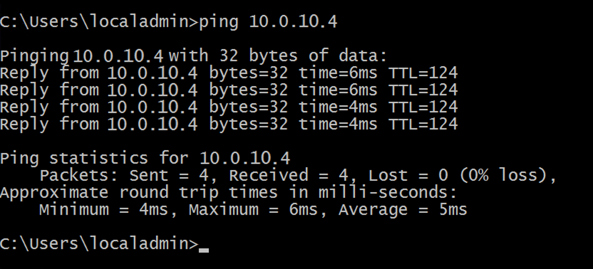
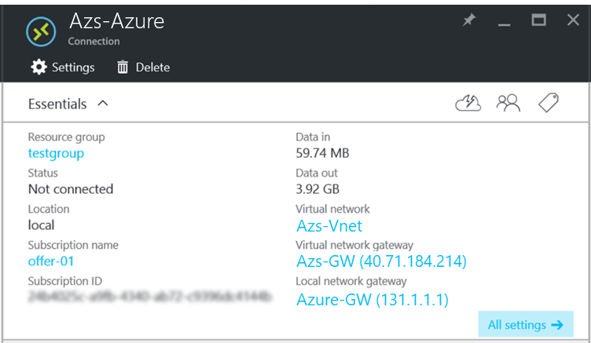

# Test the Connection

Now that the site-to-site connection is established, you should validate that you can get traffic flowing through it. To validate, sign in to one of the virtual machines that you created in Azure Stack. Then, ping the virtual machine that you created in Azure.

To make sure that you send the traffic through the site-to-site connection, ping the Direct IP (DIP) address of the virtual machine on the remote subnet, not the VIP. To do this, find the DIP address on the other end of the connection. Save the address for later use.

## Sign in to the tenant VM in Azure Stack

**Note:** below is the general procedure for testing the connection.

1. Sign in to the Azure Stack portal.

2. In the left navigation bar, select **Virtual Machines**.

3. In the list of VMs, find **Azs-VM** that you created previously, and then select it.

4. On the section for the virtual machine, click **Connect**, and then open the **Azs-VM.rdp** file.

    

5. Sign in with the account that you configured when you created the virtual machine.

6. Open an elevated **Windows PowerShell** window.

7. Type **ipconfig /all**.

8. In the output, find the **IPv4 Address**, and then save the address for later use. This is the address that you will ping from Azure. In the example environment, the address is **10.0.10.4**, but in your environment it might be different. It should fall within the **10.0.10.0/24** subnet that you created previously.

9. To create a firewall rule that allows the virtual machine to respond to pings, run the following PowerShell command:

    ```PowerShell
    New-NetFirewallRule --DisplayName "Allow ICMPv4-In" --Protocol ICMPv4
    ```

## Sign in to the tenant VM in Azure

1. Sign in to the Azure portal.

2. In the left navigation bar, click **Virtual Machines**.

3. From the list of virtual machines, find **Azure-VM** that you created previously, and then select it.

4. On the section for the virtual machine, click **Connect**.

5. Sign in with the account that you configured when you created the virtual machine.

6. Open an elevated **Windows PowerShell** window.

7. Type **ipconfig /all**.

8. You should see an IPv4 address that falls within **10.0.20.0/24**. In the example environment, the address is **10.0.20.4**, but your address might be different.

9. To create a firewall rule that allows the virtual machine to respond to pings, run the following PowerShell command:

    ```PowerShell
        New-NetFirewallRule --DisplayName "Allow ICMPv4-In" --Protocol
        ICMPv4
    ```

10. From the virtual machine in Azure, ping the virtual machine in Azure Stack, through the tunnel. To do this, you ping the DIP that you recorded from Azs-VM. In the example environment, this is **10.0.10.4**, but be sure to ping the address you noted in your lab. You should see a result that looks like the following screenshot:

    

11. A reply from the remote virtual machine indicates a successful test! You can close the virtual machine window. To test your connection, you can try other kinds of data transfers like a file copy.

## Viewing data transfer statistics through the gateway connection

If you want to know how much data passes through your site-to-site connection, this information is available on the **Connection** section. This test is also another way to verify that the ping you just sent actually went through the VPN connection.

1. While you're signed in to the user virtual machine in Azure Stack, use your user account to sign in to the user portal.

2. Go to **All resources**, and then select the **Azs-Azure** connection. **Connections** appears.

3. On the **Connection** section, the statistics for **Data in** and **Data out** appear. In the following screenshot, the large numbers are attributed to additional file transfer. You should see some non-zero values there.

    