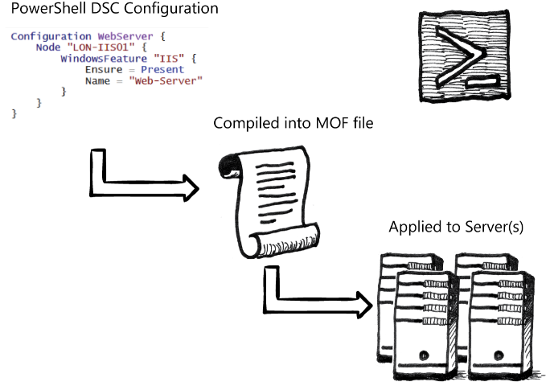

# What is PowerShell Desired State Configuration (DSC)?

PowerShell Desired State Configuration (DSC) is a management platform that administrators can use with Windows PowerShell to take advantage of the new Windows PowerShell language extensions, cmdlets, and resources. By using these new features in Windows PowerShell, administrators can declaratively specify how the software, both the operating system and the applications, should be configured.

There are three primary components of DSC:

1. **Configurations:** A configuration is a declarative Windows PowerShell script that defines and configures instances of resources. After the configuration is ran, the DSC engine uses the resources specified in the configuration to configure the system as desired.

2. **Resources:** These are the building blocks of DSC and are written specifically for the resource. You can write resources to model something as simple as ensuring a specific file is present, or as complicated as installing software and applying post-installation configuration. For example, you can configure a resource to install Microsoft SQL Server using a specific installation and then apply post-installation configuration such as ensuring backups are compressed or creating some SQL jobs for index rebuilds.

3. **Local Configuration Manager (LCM):** This is the engine that DSC uses to manage the interaction between resources and configurations. The LCM regularly tests the configuration to ensure the specified configuration is in the correct state.

The following list shows possible practical application examples:

- Enabling or disabling roles and features on servers

- Deploying and configuring software to meet your requirements

- Executing Windows PowerShell scripts

- Maintaining a configuration state

- Managing security settings