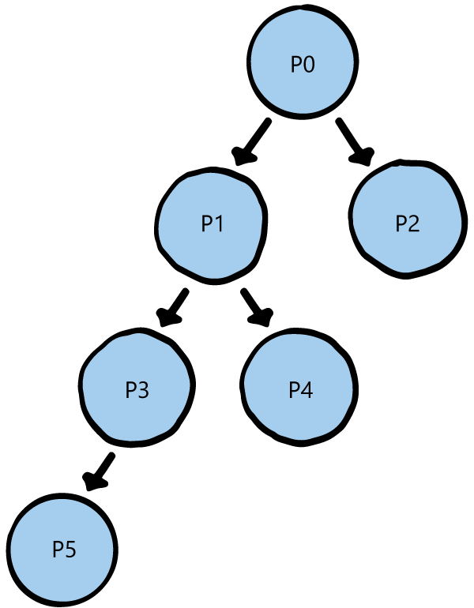

# Resource Providers API

The term provider applies to the service administrator and to any delegated providers. Azure Stack operator's and delegated providers can use the Provider Usage API to view the usage of their direct tenants. For example, P0 can call the Provider API to get usage information on P1's and P2's direct usage, and P1 can call for usage information on P3 and P4.

