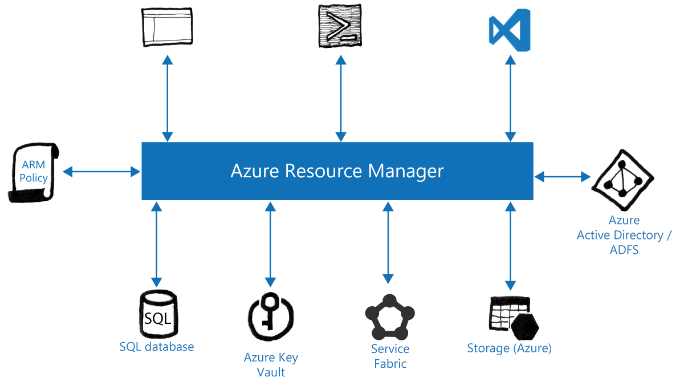

# Understanding Azure Resource Manager

Azure and Azure Stack combine multiple layers of technology to form the
overall solution. From the user experience layer to the physical
infrastructure underneath, you can control everything through the Azure
Resource Manager). Azure Resource Manager is responsible for all
communication from Resource Providers to Cloud Operators, Cloud
Administrators, and DevOps and vice versa. The diagram on the slide
shows, in detail, the position of Azure Resource Manager in the overall
architecture of Azure and Azure Stack.



## APIs

All interactions with the resource providers that power the functions of
Azure and Azure Stack occur through the ARM layer. The ARM layer exposes
itself to using Representational State Transfer (REST) APIs that are all
based on HTTPS communication. Each API is available in several versions,
and when you interact with the API, you must append the API version you
want to use by using the following format:

```html
https://management.local.azurestack.external/subscriptions/{subscriptionId}/{resourceprovider request}?api-version={API date}
```

The graphical portals supplied by Microsoft communicates with the
ARM-based REST APIs to extract information and display that in the
portal. Azure PowerShell, Azure Command-Line Interface (CLI) and
development tools such as Visual Studio communicate with ARM by using
REST APIs. The API version is critical to understanding the
functionality available from the Resource Provider.

## ARM Application Management

Application infrastructure is typically comprised of many components
such as virtual machines, storage accounts, web applications, databases,
and more. All these components are often seen as a single entity that
forms an application with resources that depend on one another to form
the application. Therefore, you want to ensure the resources that form
the application are deployed, managed, and monitored as one entity
rather than separate, disparate components.

ARM enables you to manage these resources as a group. With ARM, you can
deploy, update, and delete the resources that form your application in a
single, coordinated action. You can use templates for deployment that
are reusable across different working environments such as development,
testing, and production. Using the ARM model, you can enable auditing
and other features such as tagging to aid your management of these
resources after deployment.

To understand more about the functions of Azure Resource Manager, you
should be familiar with the terminology used. The following table
describes the terminology used in Azure Resource Manager.

|Term|ARM Definition|
|---------|---------|
|Resource|A resource is a singular manageable item available through Azure or Azure Stack. Examples of common resources are a virtual machine, a database, and a virtual network.|
|Resource Group|This is a logical entity into which resources are deployed. Each subscription can have a number of resource groups, with each resource group having several resources. Typically, you use a resource group for application lifecycle management. Therefore, the resources required for the application are deployed into the same resource group.|
|Resource Provider|This is a service that supplies resources, and you can deploy and manage them through the ARM interface. Each resource provider is solely responsible for the resources it can provide although it can work with other resource providers. For example, the Microsoft.Compute resource provider is responsible for virtual machines and this works with the Microsoft.Storage resource provider to allocate storage and create the required blobs for a virtual machine. The resource providers communicate with each other through the REST APIs they expose through ARM.|
|Resource Manager Template|These are also known as Azure Resource Manager templates. A Resource Manager template is a JSON file that contains the definition of one or more resources to be deployed into a single resource group. It defines any dependencies between resources. For example, it defines that a virtual machine requires a virtual network and a storage account. You can use a template to deploy resources consistently as many times as required.|
|Declarative Syntax|Unlike other processes, the Resource Manager template states what it wants to achieve but not how to achieve it. The template informs Azure Resource Manager what it wants to create and Azure Resource Manager can then determine the correct order of processing to ensure that an entity such as a virtual machine has a storage account and virtual network to use before it deploys the virtual machine.|

Azure Resource Manager provides several benefits, which allow you to:

- Deploy, manage, and monitor all the resources that are part of your
    solution as a group rather than as separate resources.

- Create templates that are declarative rather than creating scripts
    for deployment and you can reuse the templates throughout the
    application lifecycle knowing that the resources are deployed
    consistently each time.

- Declare resource dependency to ensure resources are deployed in the
    correct order for your solution.

- Use Azure Resource Manager to apply Role-Based Access Control (RBAC)
    to resources so that certain users/groups can only undertake the
    actions they have permission to perform and is fully integrated into
    the platform for every resource provider.

- Apply tags to resources so that you can organize resources in a way
    that works for you.

- Use tags to collate billing for resources to help identify costs of
    a solution and not just of a resource.