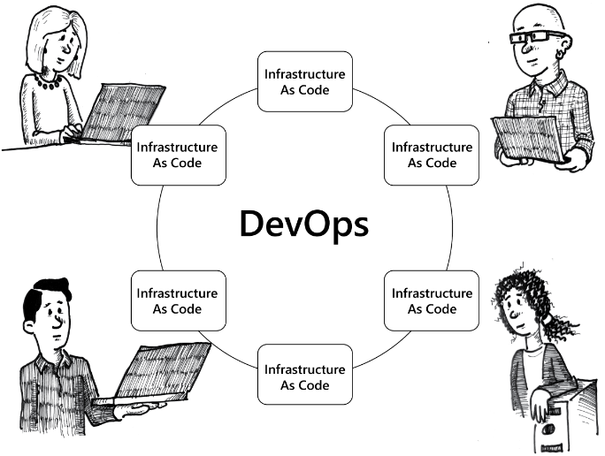

# What is DevOps

This module discusses the fundamentals of how Microsoft Azure Stack enables organizations to use DevOps. It details the foundations of Azure Stack, Azure Resource Manager, the software development kits (SDKs), and application programming interface (APIs) available. You will also learn how to use configuration management technologies such as Windows PowerShell Desired State Configuration, Chef, and Puppet to facilitate fast and consistent deployment of applications along with providing stability.

After completing this module, you will be able to:

- Understand the technologies used by DevOps in Azure Stack.

- Manage templates in Azure Resource Manager.

- Identify third-party resource providers available for Azure Stack.

The term DevOps has been used a lot in recent years to denote a change in traditional working practices. In the traditional siloed structure, the communication between silos was challenging and sometimes almost non-existent. The DevOps working practices help you migrate to a much more collaborative working structure, where communication and value is the core working practices.

Azure Stack technology can help with the following key practices in DevOps:

1. **Infrastructure as Code:** From an Azure Stack perspective, everything that is deployed with an Azure Stack subscription is software-defined or code-defined. Azure Resource Manager templates are perfect examples of Infrastructure as Code, where you can define the underlying compute, networking, and storage services for an application without requiring an underlying knowledge of the physical hardware involved.

2. **Continuous Deployment:** Because Continuous Deployment is integrated into tools such as Visual Studio Team Services and GitHub, you can enable Continuous Deployment with minimal tool investment. By having teams publish directly to code repositories and the tools that use those repositories detect changes and update applications, you can implement Continuous Deployment without complex tooling.

3. **Release Management:** By creating multiple instances of application environments such as Dev, QA, and production, you can enable Release Management. You can control who can initiate a deployment of a release by using workflow engines to ensure that the deployment meets all necessary requirements.

4. **App Performance Monitoring:** Monitoring of application performance, and not just the underlying infrastructure, is critical to delivering value to an organization. Infrastructure monitoring can only determine the state of the underlying resources. You can enable App Performance Monitoring by using the VM Agent in Infrastructure as a Service (IaaS) and other performance metrics in the Platform as a Service (PaaS) resources. You can gather this information and send it to central monitoring tools such as Microsoft System Center Operations Manager, Azure Log Analytics, or Azure Application Insights. These tools not only monitor the application but the underlying infrastructure as well.

5. **Change/Configuration Management:** By using tools such as Windows PowerShell Desired State Configuration (DSC), Chef, Puppet, and others, you can diversify the configuration management of an application environment. Multiple teams can work together to ensure the application and infrastructure is configured as required for their role. The appropriate team can perform any changes, if they are required, to the configuration of infrastructure.

6. **Self Service Environment:** By using the Azure Stack portal and other tools such as Azure PowerShell, teams can provision their own infrastructure and applications without the need to consult specific teams. By using Azure policies within a subscription, you can ensure that company standards are adhered to while still allowing the freedom of self-service.

## DevOps for Infrastructure

You can apply DevOps practices to core infrastructure and to applications. Because all infrastructure, ranging from virtual networks to storage, is software-defined, you can apply the practices that apply to applications.

## Video: Azure Stack Application Development

