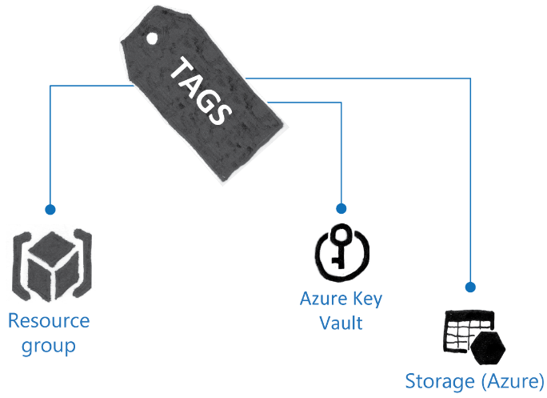

# SDKs and Tags used in Azure Stack

Azure Resource Manager includes several Software Development Kits (SDKs) that are available from Microsoft. These include:

- Microsoft .NET Framework

- Java

- Node.js

- PHP

- Python

- Ruby

The full list of SDK and Tools can be found here: <https://aka.ms/moc-10995A-pg048>.

- The .NET Framework SDK contains several products, which include:

- Visual Studio Community Edition

- Microsoft Azure Storage Emulator

- Microsoft Azure Storage Tools

- Microsoft Azure Authoring tools

- Microsoft Azure Emulator

- HDInsight Tools for Visual Studio and Microsoft Hive ODBC Driver

- Microsoft Azure Libraries for .NET

- Microsoft Azure Mobile App SDK

- Microsoft Azure PowerShell

- Microsoft Azure Tools for Microsoft Visual Studio

- Microsoft ASP.NET and Web Tools for Visual Studio

- Microsoft Azure Data Lake Tools for Visual Studio

You can use these products to develop applications that take advantage of Azure and Azure Stack functionality without having to use Azure directly. By using these tools, you can save unnecessary expenditure when developing applications.