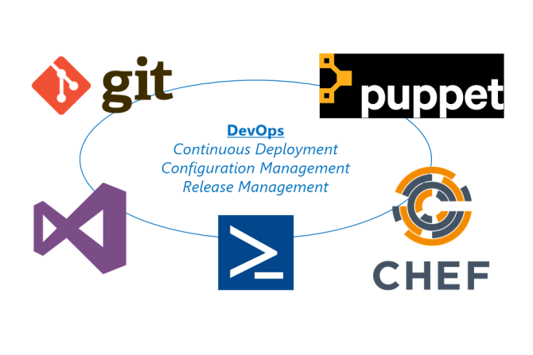

# Understanding DevOps Tools with Azure Stack

You have seen how to use PowerShell DSC to create configurations and apply them to virtual machines during deployment. The Azure Resource Manager is also capable of connecting deployments to other configuration management tools such as Chef, Puppet, BMC Control-M, and other tools.

When you deploy a virtual machine through the Azure Stack Portal, the Azure Virtual Machine Agent (VM Agent) is automatically installed for you. It is a lightweight agent that performs several tasks for you:

- Allows you to deploy additional extensions to the virtual machine as required, such as adding the Chef/Puppet agent when deploying a virtual machine.

- Enables communication between the virtual machine and the Azure Stack Fabric.

- Enables a user to undertake actions such as administrative password reset.

It is also possible for users to incorporate the VM Agent into custom images. The VM Agent can be downloaded from here <https://aka.ms/moc-10995A-az08>.

In addition to PowerShell DSC, you can deploy other configuration management agents to Azure Stack IaaS virtual machines that are provisioned by users. By using the VM Agent, you can specify which VM Agent extensions, if any, are also deployed. You can also install VM Agent extensions after deployment if required.