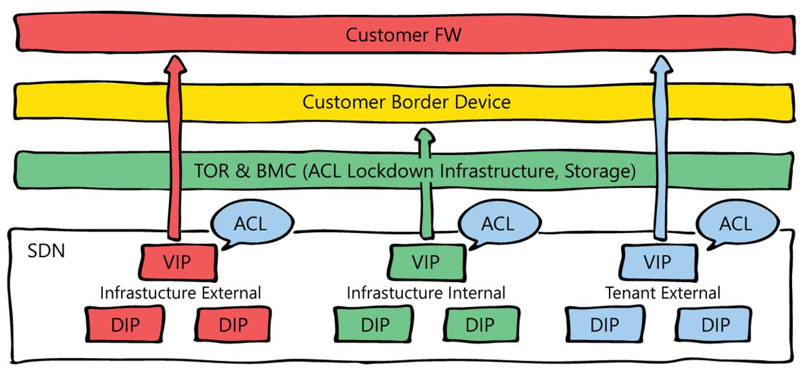

# Azure Stack Datacenter Integration - Publish Endpoints

Azure Stack sets up various endpoints (VIPs - virtual IP addresses) for its infrastructure roles. These VIPs are allocated from the public IP address pool. Each VIP is secured with an access control list (ACL) in the software-defined network layer. ACLs are also used across the physical switches (TORs and BMC) to further harden the solution. A DNS entry is created for each endpoint in the external DNS zone that was specified at deployment time.

The following diagram shows the different network layers and ACLs:

## Ports and protocols (inbound)

The infrastructure VIPs that are required for publishing Azure Stack endpoints to external networks are listed in the following table. The list shows each endpoint, the required port, and protocol. Endpoints required for additional resource providers, like the SQL resource provider and others, are covered in the specific resource provider deployment documentation.

Internal infrastructure VIPs are not listed because they’re not required for publishing Azure Stack.

**Note:** User VIPs are dynamic, defined by the users themselves with no control by the Azure Stack operator.

|Endpoint (VIP)|DNS host A record|Protocol|Ports|
|---------|---------|---------|---------|
|AD FS|Adfs.[Region].[External FQDN]|HTTPS|443|
|Portal (administrator)|Adminportal.[Region].[External FQDN]|HTTPS|443|
|Azure Resource Manager (administrator)|Adminmanagement.[Region].[External FQDN]|HTTPS|443 30024|
|Portal (user)|Portal. [Region].[External FQDN]|HTTPS|443 12495 12649 13001 13010 13011 13020 13021 30015 13003|
|Azure Resource Manager (user)|Management.[Region].[External FQDN]|HTTPS|443 30024|
|Graph|Graph.[Region].[External FQDN]|HTTPS|443|
|Certificate revocation list|Crl.[Region].[External FQDN]|HTTP|80|
|DNS|*.[Region].[External FQDN]|TCP & UDP|53|
|Key Vault (user)|*.vault.[Region].[External FQDN]|TCP TCP|443 12490|
|Key Vault (administrator)|*.adminvault.[Region].[External FQDN]|TCP TCP|443 12492|
|Storage Queue|*.queue.[Region].[External FQDN]|HTTP HTTPS|80 443|
|Storage Table|*.table.[Region].[External FQDN]|HTTP HTTPS|80 443|
|Storage Blob|*.blob.[Region].[External FQDN]|HTTP HTTPS|80 443|

## Ports and URLs (outbound)

Azure Stack supports only transparent proxy servers. In a deployment where a transparent proxy uplinks to a traditional proxy server, you must allow the following ports and URLs for outbound communication:

|Purpose|URL|Protocol|Ports|
|---------|---------|---------|---------|
|Identity|login.windows.net login.microsoftonline.com graph.windows.net|HTTP HTTPS|80 443|
|Marketplace syndication|https://management.azure.com https://*.blob.core.windows.net https://*.azureedge.net https://*.microsoftazurestack.com|HTTPS|443|
|Patch & Update|https://*.azureedge.net|HTTPS|443|
|Registration|https://management.azure.com|HTTPS|443|
|Usage|https://*.microsoftazurestack.com https://*.trafficmanager.com|HTTPS|443|