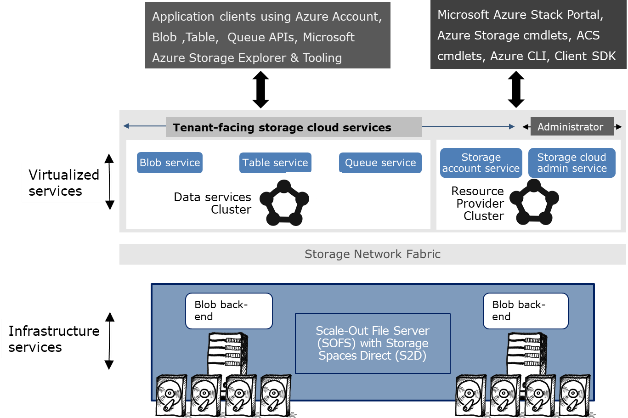

# Storage Account Architecture

In this section you will learn how Azure Stack implements Azure Consistent Storage (ACS). Azure Stack uses ACS to present storage accounts to DevOps and Cloud Operators for consumption.

You will learn about:

- Storage account architecture.

- How Azure Stack implements the underlying storage.

- How Storage Account retention works in Azure Stack.

Azure Stack storage accounts are Microsoft Azure Consistent. This ensures that API calls and Azure Resource Manager templates, achieve consistency. Each storage account offers the following functionality:

- **Blobs:** These are standard binary files, such as binary files and text files. Blobs can be grouped into three types:

- **Page:** This type of blob is optimized for random read/write operations. A typical example would be a virtual hard disk (VHD) file for a virtual machine.

- **Block:** This type of blob is a file that is optimized for streaming data. However, it could also be any binary file such as an ISO file or a Word document.

- **Append:** This type of blob is a file where you are only appending data to the existing file. An example here could be a log file where you add data only at the end of the file.

Each blob must be stored in a container, and a storage account can have as many containers as required. You can apply a different security policy to each container. Therefore, having blobs of equal security status in a container is critical.

- **Table:** Table storage is service that allows you to store structured data in a NoSQL, schemaless design. It is targeted at software developers. It is based on a key-attribute store, which ensures that every value in a table is stored with a property name. You can then use this property name for filtering and specifying selection criteria.

- **Queue:** This is a basic queuing storage that enables you to create a queue, post messages to the queue, and retrieve messages from the queue. You typically use queues between loosely coupled applications to provide a mechanism for data exchange. This type of architecture can allow applications to scale independently. The limit for a message is 64KB.

Storage accounts are created on the underlying Storage Spaces Direct (S2D) virtual disks with a defined architecture for each storage account created. When a tenant creates a storage account, a new folder is created in the underlying S2D volume that is dedicated to the tenant, and the Storage Resource Provider deploys a structure within this folder.

**Note:** The actual folder is not instantiated on the server until you add some data to the storage account. Until that point in time the storage account only exists as metadata within Azure Stack.

Each virtual machine created in Azure Stack stores its configuration files separately from its VHD files. This is because the VHD files are stored in a tenant’s storage account. Tenants cannot access these files in Azure Stack. The virtual machine configuration file stores the Virtual Machine Runtime State (VMRS) file. This file is a pre-created file that is only used to store the memory when the host encounters an issue. This file is equal in size to the amount of memory allocated to the virtual machine. Hyper-V uses this file to write the contents of the memory to when the Virtual Machine is paused.