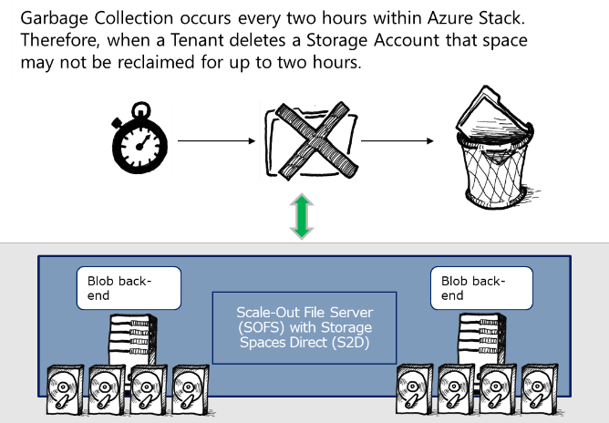

# Storage Retention in Azure Stack

Although Azure Stack differentiates itself from Azure in very few ways, in Azure Stack, you have the option to retain storage accounts after they have been deleted. Azure does not offer this feature.

When a tenant deletes a storage account in Azure, the Storage resource provider immediately marks the data for deletion. In Azure Stack, the deleted storage account is retained for 15 days by default.

The Azure Stack Cloud Operator configures the retention period for storage accounts at an Azure Stack region level. This allows you to configure different retention options based on the available capacity within a specific location. The retention range runs from 0 days, where the Storage Account is marked as out of retention period and can be purged on the next automatic garbage collection, to a maximum of 9999 days (27.4 years).

When a tenant deletes a storage account, the account is removed from the tenant’s subscription and the tenant is given a notice stating:

`"Deleting the storage account <Storage Account Name> is irreversible. The action you're about to take can't be undone. Continuing will permanently delete this storage account."`

At this point, only changes in the Azure Stack database would have occurred in the storage account.

The following high-level steps show you how to recover a deleted storage account:

1. In the Azure Stack portal, sign-in as an Azure Stack Cloud Operator.

2. Navigate to Region Management.

3. Select the region where the storage account resides.

4. Select the Storage resource provider.

5. Select storage accounts under the tenant resource.

6. Find the required storage account that has been deleted. The name of the storage account would have been changed to `@<Date/Time of deletion>`.

7. Select the storage account.

8. On the Storage Account blade, click Recover.

9. The Storage Account is then renamed to the original storage account name and placed back in the tenant’s subscription.

**Note:** If the tenant creates another storage account with the same name, regardless of the resource group, then you will not be able to recover the storage account.

After a tenant deletes a storage account, the data is retained and will continue to use storage in the underlying S2D infrastructure. As an Azure Stack Administrator, you can reclaim the space as required. For example, if a Tenant deletes a Storage Account containing 5 terabytes (TB) of data, you might want to purge this to reclaim the space.

This retained space will not count towards any quota that is set on the tenant’s subscription. Therefore, you should take this into consideration when determining the time period for the storage account retention.