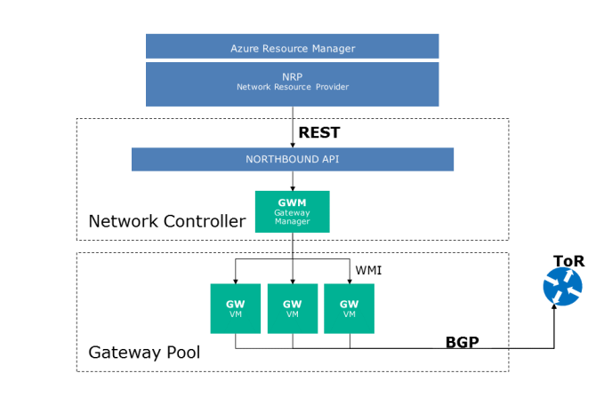

# External Connectivity to Azure Stack Tenant Networks

Azure Stack relies on the Windows Server Gateway from Windows Server 2016 to facilitate external connectivity. Windows Server Gateway uses a multi-instance Remote Access Server (RAS) Gateway deployment to ensure high-availability and load balancing of the feature.

In Azure Stack, the RAS Gateway is configured to use a pool of servers in an M+N configuration. The following section describes the characteristics of an M + N configuration:

- In the M+N configuration, there are M active gateways and N standby gateways. The value of N is always less than the value on M. For example, you could configure it as 2+1. This differs from how RAS Gateways are implemented in Windows Server 2012 R2 where these gateways are configured as 1+1 active/passive gateways and can lead to over provisioning of resources.

- The RAS Gateway Pool can perform a set of specific functions such as just Internet Key Exchange version 2 (IKEv2) Site-to-Site (S2S) virtual private network (VPN) or Layer 3 forwarding, or Generic Routing Encapsulation (GRE).

- You can assign a single public IP address to all the configured pools. This reduces the number of IP addresses required for the pool. However, Azure Stack does not implement this.

- You can scale out or scale in an RAS Gateway Pool easily by adding or removing virtual machines in the pool. This process is non-disruptive.

You can provide a variety of pools available for tenants to utilize. Each pool can have different performance characteristics. For example, if you have two pools, the first could offer up to 50 Mbps throughput and the second pool could offer 100Mbps throughput. This can potentially allow you to charge more for higher throughput connectivity.

Note that it is not mandatory for the tenants to have a connection to an RAS Gateway Pool for their workloads to connect to the Internet. Tenant virtual machines can access the Internet through a network address translation (NAT) interface from the Azure Stack fabric. This will not allow inbound connectivity.

If you attach a Public IP address directly to a virtual network adapter on a virtual machine, all Transmission Control (TCP)/User Datagram Protocol (UDP) ports will be accessible by default. To prevent unauthorized access to the virtual machine, you should apply a combination of an NSG on the network adapter at the Azure Virtual Network layer and in guest firewall software.

Azure Stack uses BGP to advertise any publicly available IP address. Each IP is advertised as a /32 IP address in Classless Inter-Domain Routing (CIDR) notation. This routing information is exchanged from the SLB virtual machines in Azure Stack to the Top of Rack (ToR) switches and subsequently aggregate switches or border devices.