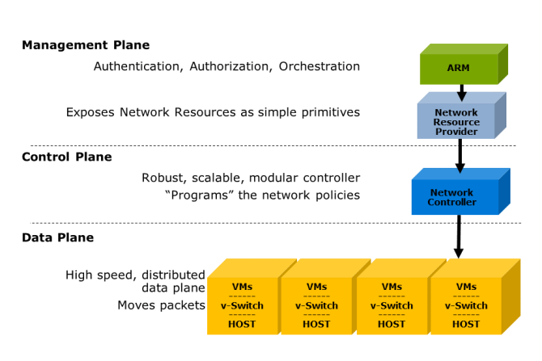

# Hyper-V Network Virtualization

Hyper-V Network Virtualization (HNV) is the software-defined networking (SDN) from Microsoft. Microsoft created its first SDN stack in Windows Server 2012 using Microsoft System Center Virtual Machine Manager (SCVMM) and Hyper-V. The Network Virtualization used the Generic Routing Encapsulation (NVGRE) protocol to carry tenant-defined networking. This is known as HNVv1.

HNV requires the use of a filter driver within the Hyper-V virtual switch on Hyper-V hosts. This filter driver is responsible for manipulating the network packets as they ingress and egress the Hyper-V host. Because a network packet could be destined for another tenant machine, the Hyper-V host needs to know where the destination workload is hosted. By identifying which Hyper-V host the target machine is located on, the packet can be encapsulated by using the HNV network protocol and sent to the correct host. This requires knowledge of all the tenant workloads in the environment. With technologies such as Live Migration in Hyper-V, the distribution of this knowledge in a timely manner is critical.