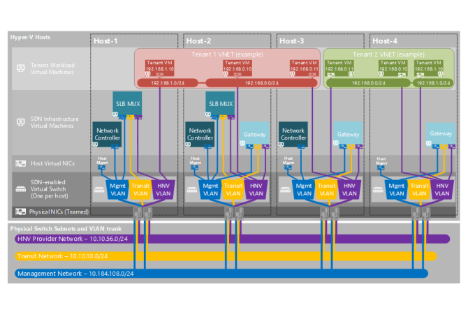

# IaaS Software Defined Networking

The Network Controller is responsible for managing all aspects of the SDN within Azure Stack. The Network Controller uses various technologies to update the SDN layers to ensure the tenant networks work as required. It uses industry-standard protocols for updating hosts and physical network appliances. It is highly reliant on the Border Gateway Protocol (BGP) to exchange routing information between routers and the SDN layer.

With the HNVv2 stack, Microsoft has included two key Network Function Virtualization features:

- Software load balancer. This operates within the SDN layer and is controlled by the Network Controller. It is the same Software Load Balancer that is available in Azure. It is a Layer 4 load balancer that supports both internal and external load balancing. A software load balancer uses health probes, either HTTP-based or TCP-based, to determine if a load-balanced node is healthy or not.

- Distributed Firewall. Within the SDN stack, you can create Layer 4-based firewall rules. You can create rules based on the following factors:

- Source IP Address

- Protocol type, such as TCP/UDP

- Source port

- Destination IP Address

- Destination Port

This allows you to restrict the traffic flow between subnets in a tenant SDN or even to the virtual network adapter level. Within Azure Stack, these features are surfaced through Network Security Groups. Note that within the distributed firewall, there is no provision for application-level (Layer 7) packet inspection.

The Network Controller is responsible for deploying all SDN network-related items in Azure Stack. There is no reliance on SCVMM.