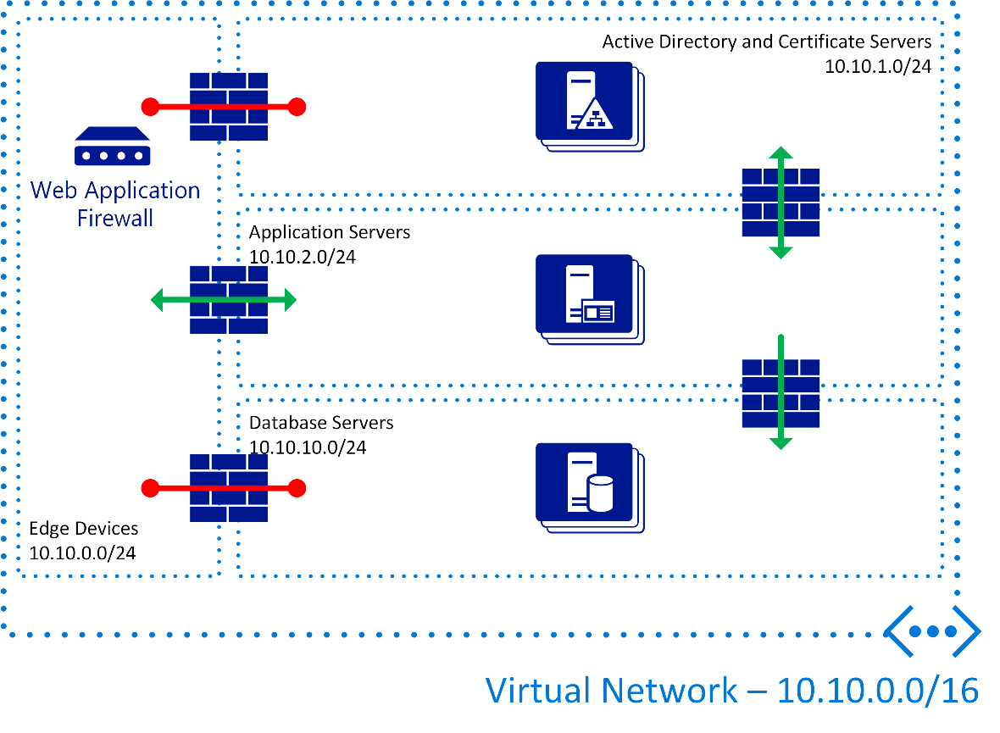

# SDN Sample Scenario

Contoso Ltd. want to create software-defined networks that match their production environment to enable the testing of changes. By using software-defined networking, Contoso wants to create two new networks: one for development of new software and one for testing. Ideally, you should identically configure these networks to the production network with the following settings:

- Internal IP address space is: 10.10.0.0/16

- Subnets required:

  - Edge devices: 10.10.0.0/24
  - Active Directory Domain Controllers and Certificate Servers: 10.10.1.0/24
  - Application servers: 10.10.2.0/24
  - Database servers: 10.10.10.0/24

- Firewall rules to prevent communication from the Edge Devices to the database servers.

In this scenario, you can create two software-defined networks, with identical configurations including the address space and subnets, and server workloads. The following diagram shows the configuration:

As seen above, network configuration is not straightforward. The following table shows the server list that is required:

|Server Name|IP Address|Description|
|---------|---------|---------|
|CON-WAF01|10.10.0.10/24|Web Application Firewall|
|CON-AD01|10.10.1.10/24|Active Directory Domain Controller – FSMO Role Holder|
|CON-AD02|10.10.1.11/24|Active Directory Domain Controller|
|CON-APP01|10.10.2.10/24|Application Server|
|CON-APP02|10.10.2.11/24|Application Server|
|CON-DBS01|10.10.10.10/24|Microsoft SQL Server|
|CON-DBS02|10.10.10.11/24|MySQL server|

Each of the required environments requires the same servers in the same configuration to ensure they are mirrored.

Using Hyper-V Network Virtualization, Contoso Ltd. can create the required networks and configure them in an identical way, on the same Hyper-V host hardware. Each of the networks receives its own virtual network ID that forms part of the network packet encapsulation. Hyper-V hosts use this virtual network ID to identify to which tenant network the traffic should be sent. The Network Controller role, with which the Hyper-V hosts are registered, is responsible for updating the Hyper-V hosts with all the tenant network information.

You could place the entire Azure Stack configuration for this network into an Azure Resource Manager template and use it to create both networks to ensure they are identical. Azure Resource Manager processes the Azure Resource Manager template, authenticates the request, ensures tenants have access to the Microsoft.Network resource provider as part of their subscription, and then communicates the requirements to the Microsoft.Network resource provider.