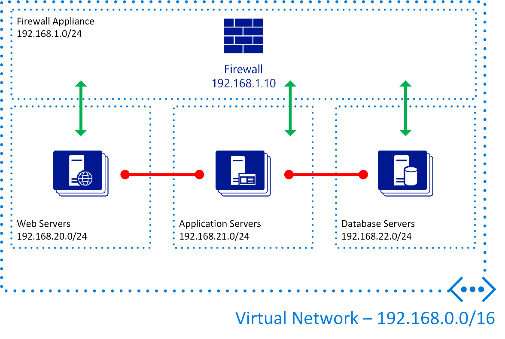

# User Defined Routing and IP Forwarding

When you create a virtual network in Azure Stack, all subnets in that virtual network can communicate with each other without restrictions. NSGs can prevent communication from one subnet/IP address to another. However, consider a scenario where you want communication between subnets/IP addresses but you want to implement a firewall or some other packet inspection process to ensure the integrity of the communication. You can use user-defined routing (UDR) with IP forwarding enabled for such scenarios.

You specify UDRs at the subnet level and these are designed to control traffic between subnets, whether those subnets are part of the virtual network or not. You specify UDRs in route tables and determine what the next hop is for a destination subnet. For example, to control how the network traffic that is destined for the Internet, regardless of the protocol in use, is routed, you can create a route table. You can tell the virtual network to send traffic destined for 0.0.0.0/0 (the default route) to a specific IP address that belongs to a firewall deployed in your virtual network or elsewhere such as an on-premises appliance.

The following diagram shows a simple configuration where direct communication between subnets is not permitted:

The following table shows how to implement the configuration shown in the preceding diagram:

|Rule Name|Destination Prefix|Next Hop|
|---------|---------|---------|
|WebToApp|192.168.21.0/24|192.168.1.10|
|AppToWeb|192.168.20.0/24|192.168.1.10|
|AppToDBS|192.168.22.0/24|192.168.1.10|

These rules are applied to the required subnets to ensure traffic is sent to the firewall appliance. In the Azure Stack network, the Network Interface on the firewall, has IP forwarding enabled to allow the forwarding of network traffic. You can combine this example scenario with NSGs to ensure that the NSG prevents communication in case there are any accidental changes to the UDR.

You can configure the firewall appliance with rule sets that permit the required traffic to be sent and inspected if required.