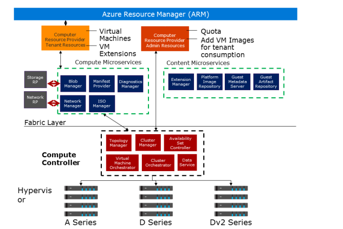

# Different Virtual Machine Types in Microsoft Azure Stack

Virtual Machines are the underlying infrastructure for all the services in Azure Stack and typically for tenant applications too. If tenants use the Azure Stack App Service, then the underlying infrastructure runs on virtual machines.

Azure Stack provides only a subset of the virtual machine sizes that is available in Azure, which the following table lists:

## General Purpose

General-purpose VM sizes provide a balanced CPU-to-memory ratio. They are used for testing and development, small to medium databases, and low to medium traffic web servers. Each data disk is 2300 IOPS for the premium VM sizes, except for the Basic A series. For Basic A, the data disk size is 500 IOPS.

### Basic A-series

|Size|vCPU|Memory|Max temporary disk size|Max OS disk throughput: (IOPS)|Max temp storage throughput (IOPS)|Max data disk throughput (IOPS)|Max NICs|
|---------|---------|---------|---------|---------|---------|---------|---------|
|Basic_A0|1|768 MB|20 GB|300|300|1 / 1x300|1|
|Basic_A1|1|1.75 GB|40 GB|300|300|2 / 2x300|1
|Basic_A2|2|3.5 GB|60 GB|300|300|4 / 4x300|1|
|Basic_A3|4|7 GB|120 GB|300|300|8 / 8x300|1|
|Basic_A4|8|14 GB|240 GB|300|300|16 / 16X300|1|

### Standard A-series

|Size|vCPU|Memory (GiB)|Temp storage (GiB)|Max OS disk throughput (IOPS)|Max temp storage throughput (IOPS)|Max data disks / throughput (IOPS)|Max NICs|
|---------|---------|---------|---------|---------|---------|---------|---------|
|Standard_A0|1|0.768|20|500|500|1 / 1x500|1|
|Standard_A1|1|1.75|70|500|500|2 / 2x500|1|
|Standard_A2|2|3.5|135|500|500|4 / 4x500|1|
|Standard_A3|4|7|285|500|500|8 / 8x500|2|
|Standard_A4|8|14|605|500|500|16 / 16x500|4|
|Standard_A5|2|14|135|500|500|4 / 4x500|2|
|Standard_A6|4|28|285|500|500|8 / 8x500|2|
|Standard_A7|8|56|605|500|500|16 / 16x500|4|

### Av2-series

|Size|vCPU|Memory (GiB)|Temp storage (GiB)|Max OS disk throughput (IOPS)|Max temp storage throughput (IOPS)|Max data disks / throughput (IOPS)|Max NICs|
|---------|---------|---------|---------|---------|---------|---------|---------|
|Standard_A1_v2|1|2|10|500|1000|2 / 2x500|2|
|Standard_A2_v2|2|4|20|500|2000|4 / 4x500|2|
|Standard_A4v2|4|8|40|500|4000|8 / 8x500|4|
|Standard_A8_v2|8|16|80|500|8000|16 / 16x500|8|
|Standard_A2m_v2|2|16|20|500|2000|4 / 4x500|2|
|Standard_A4m_v2|4|32|40|500|4000|8 / 8x500|4|
|Standard_A8m_v2|8|64|80|500|8000|16 / 16x500|8|

### D-series

|Size|vCPU|Memory (GiB)|Temp storage (GiB)|Max OS disk throughput (IOPS)|Max temp storage throughput (IOPS)|Max data disks / throughput (IOPS)|Max NICs|
|---------|---------|---------|---------|---------|---------|---------|---------|
|Standard_D1|1|3.5|50|500|3000|4 / 4x500|1|
|Standard_D2|2|7|100|500|6000|8 / 8x500|2|
|Standard_D3|4|14|200|500|12000|16 / 16x500|4|
|Standard_D4|8|28|400|500|24000|32 / 32x500|8|

### DS-series

|Size|vCPU|Memory (GiB)|Temp storage (GiB)|Max OS disk throughput (IOPS)|Max temp storage throughput (IOPS)|Max data disks / throughput (IOPS)|Max NICs
|---------|---------|---------|---------|---------|---------|---------|---------|
|Standard_DS1|1|3.5|7|1000|4000|4 / 4x2300|1
|Standard_DS2|2|7|14|1000|8000|8 / 8x2300|2
|Standard_DS3|4|14|28|1000|16000|16 / 16x2300|4
|Standard_DS4|8|28|56|1000|32000|32 / 32x2300|8

### Dv2-series

|Size|vCPU|Memory (GiB)|Temp storage (GiB)|Max OS disk throughput (IOPS)|Max temp storage throughput (IOPS)|Max data disks / throughput (IOPS)|Max NICs|
|---------|---------|---------|---------|---------|---------|---------|---------|
|Standard_DS1|1|3.5|7|1000|4000|4 / 4x2300|1|
|Standard_DS2|2|7|14|1000|8000|8 / 8x2300|2|
|Standard_DS3|4|14|28|1000|16000|16 / 16x2300|4|
|Standard_DS4|8|28|56|1000|32000|32 / 32x2300|8|

### DSv2-series

|Size|vCPU|Memory (GiB)|Temp storage (GiB)|Max OS disk throughput (IOPS)|Max temp storage throughput (IOPS)|Max data disks / throughput (IOPS)|Max NICs|
|---------|---------|---------|---------|---------|---------|---------|---------|
|Standard_DS1_v2|1|3.5|7|1000|4000|4 / 4x2300|1|
|Standard_DS2_v2|2|7|14|1000|8000|8 / 8x2300|2|
|Standard_DS3_v2|4|14|28|1000|16000|16 / 16x2300|4|
|Standard_DS4_v2|8|28|56|1000|32000|32 / 32x2300|8|
|Standard_DS5_v2|16|56|112|1000|64000|64 / 64x2300|8|

## Compute optimized

### F-series

    Requires Azure Stack version 1804 or later

|Size|vCPU|Memory (GiB)|Temp storage (GiB)|Max OS disk throughput (IOPS)|Max temp storage throughput (IOPS)|Max data disks / throughput (IOPS)|Max NICs|
|---------|---------|---------|---------|---------|---------|---------|---------|
|Standard_F1|1|2|16|500|3000|4 / 4x500|2|
|Standard_F2|2|4|32|500|6000|8 / 8x500|2|
|Standard_F4|4|8|64|500|12000|16 / 16x500|4|
|Standard_F8|8|16|128|500|24000|32 / 32x500|8|
|Standard_F16|16|32|256|500|48000|64 / 64x500|8|

### Fs-series

    Requires Azure Stack version 1804 or later

|Size|vCPU|Memory (GiB)|Temp storage (GiB)|Max OS disk throughput (IOPS)|Max temp storage throughput (IOPS)|Max data disks / throughput (IOPS)|Max NICs|
|---------|---------|---------|---------|---------|---------|---------|---------|
|Standard_F1s|1|2|4|1000|4000|4 / 4x2300|2|
|Standard_F2s|2|4|8|1000|8000|8 / 8x2300|2|
|Standard_F4s|4|8|16|1000|16000|16 / 16x2300|4|
|Standard_F8s|8|16|32|1000|32000|32 / 32x2300|8|
|Standard_F16s|16|32|64|1000|64000|64 / 64x2300|8|

### Fsv2-series

    Requires Azure Stack version 1804 or later

|Size|vCPU|Memory (GiB)|Temp storage (GiB)|Max OS disk throughput (IOPS)|Max temp storage throughput (IOPS)|Max data disks / throughput (IOPS)|Max NICs|
|---------|---------|---------|---------|---------|---------|---------|---------|
|Standard_F2s_v2|2|4|16|1000|4000|4 / 4x2300|2|
|Standard_F4s_v2|4|8|32|1000|8000|8 / 8x2300|4|
|Standard_F8s_v2|8|16|64|1000|16000|16 / 16x2300|8|
|Standard_F16s_v2|16|32|128|1000|32000|32 / 32x2300|8|
|Standard_F32s_v2|32|64|256|1000|64000|32 / 32x2300|8|
|Standard_F64s_v2|64|128|512|1000|128000|32 / 32x2300|8|

## Memory optimized

Memory optimized VM sizes provide a high memory-to-CPU ratio that is designed for relational database servers, medium to large caches, and in-memory analytics.

### D-series

|Size|vCPU|Memory (GiB)|Temp storage (GiB)|Max OS disk throughput (IOPS)|Max temp storage throughput (IOPS)|Max data disks / throughput (IOPS)|Max NICs|
|---------|---------|---------|---------|---------|---------|---------|---------|
|Standard_D11|2|14|100|500|6000|8 / 8x500|2|
|Standard_D12|4|28|200|500|12000|16 / 16x500|4|
|Standard_D13|8|56|400|500|24000|32 / 32x500|8|
|Standard_D14|16|112|800|500|48000|64 / 64x500|8|

### DS-series

|Size|vCPU|Memory (GiB)|Temp storage (GiB)|Max OS disk throughput (IOPS)|Max temp storage throughput (IOPS)|Max data disks / throughput (IOPS)|Max NICs|
|---------|---------|---------|---------|---------|---------|---------|---------|
|Standard_DS11|2|14|28|1000|8000|8 / 8x2300|2|
|Standard_DS12|4|28|56|1000|12000|16 / 16x2300|4|
|Standard_DS13|8|56|112|1000|32000|32 / 32x2300|8|
|Standard_DS14|16|112|224|1000|64000|64 / 64x2300|8|

### Dv2-series

|Size|vCPU|Memory (GiB)|Temp storage (GiB)|Max OS disk throughput (IOPS)|Max temp storage throughput (IOPS)|Max data disks / throughput (IOPS)|Max NICs|
|---------|---------|---------|---------|---------|---------|---------|---------|
|Standard_D11_v2|2|14|100|500|6000|8 / 8x500|2|
|Standard_D12_v2|4|28|200|500|12000|16 / 16x500|4|
|Standard_D13_v2|8|56|400|500|24000|32 / 32x500|8|
|Standard_D14_v2|16|112|800|500|48000|64 / 64x500|8|

### DSv2-series

|Size|vCPU|Memory (GiB)|Temp storage (GiB)|Max OS disk throughput (IOPS)|Max temp storage throughput (IOPS)|Max data disks / throughput (IOPS)|Max NICs|
|---------|---------|---------|---------|---------|---------|---------|---------|
|Standard_DS11_v2|2|14|28|1000|8000|4 / 4x2300|2|
|Standard_DS12_v2|4|28|56|1000|16000|8 / 8x2300|4|
|Standard_DS13_v2|8|56|112|1000|32000|16 / 16x2300|8|
|Standard_DS14_v2|16|112|224|1000|64000|32 / 32x2300|8|

The sizes listed in the preceding tables are consistent with Azure virtual machines. Additionally, the level of functionality these virtual machines offer is comparable with Microsoft Azure. For example, the number of network adapters and data disks each virtual machine can have is limited by the instance size and matches that of Azure. This is to ensure that any Azure Resource Manager templates that are developed for these instance sizes will match Azure Stack or Azure.

**Note:** As an Azure Stack Cloud Operator, you cannot create your own sizes of virtual machines or adjust the predetermined sizes. This is to ensure consistency with Azure.

When you deploy virtual machines in Azure Stack, several different components are involved in the deployment process as shown on the following slide. Because Microsoft has developed Azure Stack using a microservices architecture, each component undertakes its task and reports back to the controller.

- Compute Resource Provider Tenant Resources. Each virtual machine that is deployed must have a storage account and a virtual network. This component checks that the referenced entities exist and that the configuration has all the required properties set. It creates a model of the deployment and a sequence of work activities to deploy the virtual machine.

- Blob Manager. This is the component that communicates with the Storage resource provider to convert the Blob URL from the Storage Account, to an SMB path that you can use with Hyper-V because Hyper-V cannot use a URL for its storage path.

- Network Manager. This component communicates with the Network Resource Provider to create an appropriate network adapter configuration and obtain a MAC address.

- Compute Controller. This component instructs Hyper-V to create the virtual machine and is also responsible for any edits to a virtual machine.

- Placement Manager. This communicates with the Cluster Manager component to determine where the virtual machine should be deployed.

- ISO Manager. This creates a dedicated ISO for the virtual machine to use during provisioning. The unattend.xml file is placed in this ISO to enable specialization of the virtual machine.

- Diagnostics Manager. This is responsible for collecting all the required diagnostic information from the virtual machine, including event logs or boot diagnostics.

- Cluster Manager. This monitors the status of the nodes in Hyper-V to ensure it is aware of their status and can aid the Placement Manager in determining resource location.

- Topology Manager. This maintains a list of all the hosts and clusters that are available to the Computer Resource Provider.

- Availability Set Controller. This ensures that virtual machines are placed in the correct Azure Stack fabric fault domain. This ensures an even distribution of virtual machines in an availability set.