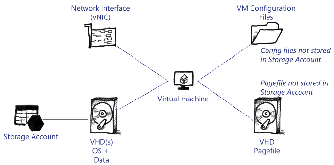

# Virtual Machine Architecture

Virtual machines in Azure Stack are structured similarly to Azure virtual machines:

## Structure of a Virtual Machine

All Azure Stack and Azure virtual machines are Hyper-V Generation 1 virtual machines. This means the boot process does not use a Unified Extensible Firmware Interface (UEFI) firmware for boot, instead it uses a traditional BIOS. Therefore, you should be aware of the following limitations:

- **VHD files:** Azure Stack only uses VHD files and not the newer VHDX file format. This is for consistency with Microsoft Azure.

- **IDE Boot:** The operating system disk must be attached to an IDE Controller inside the virtual machine.

- **Pagefile:** The drive that stores the pagefile must be attached to an IDE Controller. If you move the drive containing the pagefile to a SCSI Controller, it will not work.

**Note:** Although there are other limitations of Generation 1 virtual machines, the preceding list is the most pertinent when discussing Azure Stack virtual machines.

A virtual machine is composed of two distinct elements:

1. **Virtual Machine Configuration:** These are the files that constitute the virtual machine and Hyper-V uses them to create the virtual machine. The primary file for Azure Stack virtual machines is the VMCX file. This is a binary file that defines the virtual machine. It contains configuration data such as the boot order, the network adapter configuration, VHD configuration, and more.

2. **Virtual Hard Disks:** Every virtual machine requires a virtual hard disk. In Azure Stack, these are attached to a virtual machine through a storage account. When you start the virtual machine on a Hyper-V host, the Compute Resource Provider translates the URIs of the VHD files to local paths available to the Hyper-V host. A VHD file cannot be attached to a virtual machine by using the HTTP protocol.