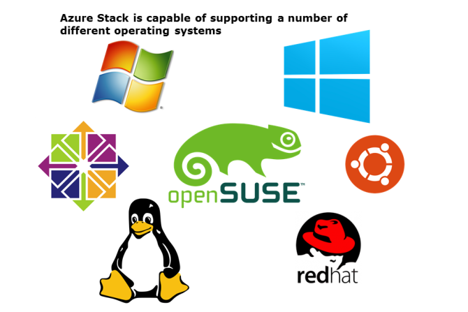
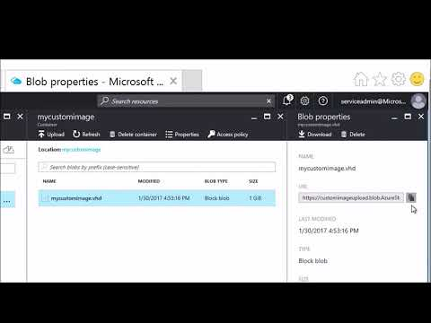

# Virtual Machine Guest Operating Systems

Azure Stack supports the same guest operating systems as Azure. The following table lists the supported distributions of Linux.

In this lesson you will learn about virtual machines in Azure Stack. This covers various different aspects of virtual machines, including operating system support, the types and sizes of virtual machines available in Azure Stack and the architecture of virtual machines in Azure Stack.

After completing this lesson, you will be able to:

- Identify which virtual machine guest operating systems are supported.

- Understand the different virtual machine types in Azure Stack.

- Understand the virtual machine architecture in Azure Stack.

|Distribution|Versions|
|---------|---------|
|CentOS by OpenLogic|CentOS 6.3+, 7.0+|
|CoreOS|494.4.0+|
|Debian|Debian 7.9+, 8.2+|
|Oracle Linux|6.4+, 7.0+|
|Red Hat Enterprise Linux|RHEL 6.7+, 7.1+|
|SUSE Linux Enterprise|SLES 11 SP4, SLES 12 SP1+ and SLES for SAP|
|openSUSE|openSUSE Leap 42.1+|
|Ubuntu|Ubuntu 12.04, 14.04, 16.04, 16.10|

The following table lists the Windows operating systems that Azure Stack supports:

|Type|Versions|
|---------|---------|
|Windows Server|Windows Server 2008 R2 SP1, Windows Server 2012 Datacenter, Windows Server 2012 R2 Datacenter, Windows Server 2016 Datacenter|

***

## Video: Azure Stack Virtual Machines

