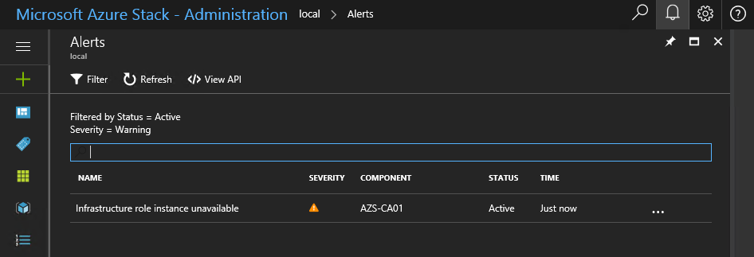
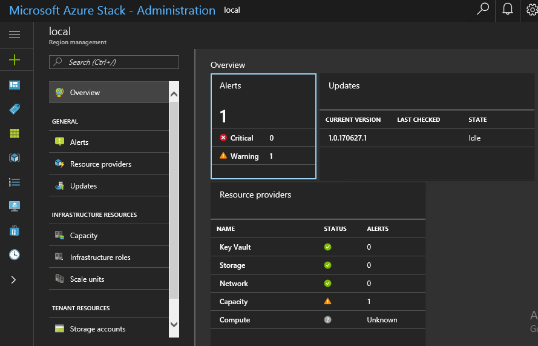

# Azure Stack Control Plane Monitoring

Monitoring Azure Stack and its underlying infrastructure is critical to providing users with the cloud services and applications they need. If a host fails within the Azure Stack infrastructure, you need to be made aware so that you can put procedures in place to replace or repair the host.

In this lesson, you will learn about the built-in health monitoring that Azure Stack provides for its infrastructure and various software components such as the network controller and Azure Resource Manager. You will also learn how to monitor Azure Stack by using other tools such as Microsoft System Center Operations Manager.

After completing this section you will be able to:

- Describe the Health Service and Health Service resource provider in Azure Stack.

- Monitor Azure Stack by using other tools including Operations Manager.

## Health Service and Health Resource Provider

Azure Stack includes health monitoring for its infrastructure and software components by using the Heath resource provider. You can perform monitoring on a region-by-region basis. Monitoring is reflected in this way because each region has its own set of hardware and software components dedicated for that location for Azure Stack.

When you install Azure Stack, each infrastructure component registers itself with the Health Resource Provider and starts to report its health status and any relevant alerts. The health of each component is reflected as the worst state. That is, if any component reports a warning state, then the overall health state would be reflected as a warning state. If some components are in a warning state and other components are in a critical state, the overall health would be displayed as a critical state.

An infrastructure component can be in one of the following three health states:

- **Healthy:** All components are running as expected.

- **Warning:** Some components are reporting a problem, but it does not affect the overall service.

- **Critical:** Some components are failing, and this is affecting the overall service.

You can view the health of each region by using the Azure Stack Portal, the REST API, or Windows PowerShell. You can view the health of Azure Stack by using the Azure Stack Portal from the Region Management blade. When you open Region Management, it displays a list of registered regions including the number of Warning and Critical alerts generated for each region. As you click each region, an overview is provided that includes the following useful information:

- **Alerts:** The number of warning and critical alerts generated.

- **System Health Tests (user Services):** The status and number of failed tests for user services such as storage and networks.

- **Resource Providers:** The resource providers that are currently registered with the Health resource provider.

- **Infrastructure Roles:** The infrastructure components being monitored including the status and number for each component.

- **Updates:** The current update status of the Azure Stack resource in that region. This includes the current version, last checked data, and state (as in UpToDate).

This overview page is very useful because it provides an overall view into health state of every Azure Stack component in the selected region. The following diagram displays an example overview page for the local Azure Stack region.

## Azure Stack Region Management

In the diagram below, notice that a single page provides the overall health state for the region. For those that are familiar with Operations Manager, this is similar to a dashboard view, where multiple monitored components are displayed in a single view.

Another useful feature of this view is that you can right-click a tile, such as the Alerts tile, and select the Pin to dashboard option. This makes the tile available on the dashboard making it easier to access because it is then displayed automatically when you sign in to the Azure Stack Portal.

**Note:** Only Admin portal users have access to the Region Management blade.

When you click the Alert tile, a list of Warning and Critical alerts (if generated) will be displayed. You can optionally click the Warning or Critical text within the tile to filter the alerts by alert type. As an example, consider the following scenario:

1. The SQL Server AzS-SQL01 is inadvertently powered off in an Azure Stack environment.

2. On the Region Management blade, the overall health state for the region changes to Warning.

3. On the Alerts tile, a Warning alert is displayed.

4. When you click the warning text in the Alert tile the Alerts view opens and displays the corresponding alert.

Included with the Alert are the following properties:

- **Name:** The descriptive name for the alert. In the scenario above, this would be "AzS-SQL01 is offline or unreachable".

- **Severity:** The severity of the alert such as Warning or Critical. In the scenario above, this would be Warning.

- **Impacted component:** The affect component that caused the alert. In the scenario above, this would-be AzS-SQL01.

- **Status:** The Status of the alert such as Active or Closed. In the scenario above, this would be Active.

- **Source:** The Health Resource Provider source that detected the issue. In this case, this would be HeartbeatScanner.

- **Time:** The time that the alert was generated.

When you click an alert, additional information including a description and possible remediation steps that can be followed to resolve the alert are provided. This is useful as it can prove as a valuable asset in resolving issue in the Azure Stack environment.

Note that the alert generated in the scenario above was a Warning alert. This is because the Health Resource provider deemed that although it is an issue that requires resolving, it is not a critical issue that requires immediate attention. In this scenario, software updates would not be available but the overall Azure Stack environment would still function.

Another useful feature that is similar in comparison to Operations Manager is the auto-resolve feature. When the Health resource provider detects that the underlying issue that caused the alert to be generated is now resolved, it automatically closes the alert in the Alerts tile. This is useful because in some cases. For example, when maintenance is being performed, the associated alerts will be automatically closed when maintenance has completed. However, you can still view the alerts that are closed by configuring the filter in the Alert view. This feature is helpful when you troubleshoot an ongoing issue in Azure Stack. You can filter the Alert view to show all Closed and Active alerts, and perform a correlation between them to help determine when an alert was first generated and how often it has occurred.