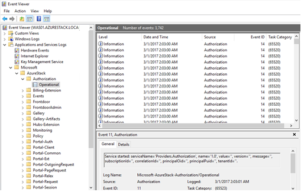

# Monitoring Azure Stack Using Additional Tools

Although Azure Stack provides comprehensive monitoring of its own infrastructure components, you also have the option of monitoring Azure Stack with other tools and third-party applications. Additionally, Azure Stack does not provide monitoring of user workloads. Therefore, you might want to include monitoring as a service for applications and services that users deploy using Azure Stack. The following section describes some of the most common tools and third-party applications that you can use to monitor Azure Stack.

## System Center Operations Manager

System Center Operations Manager is an industry-standard solution that includes best practice health and availability monitoring for applications and services including their underlying hardware and networking components. Although you cannot adopt Operations Manager agent-based monitoring in Azure Stack, you can perform agentless monitoring. Azure Stack does not support installing agents on any of its infrastructure components to ensure they are maintained solely for use with Azure Stack. However, agentless monitoring is possible because the Operations Manager agent is installed on a proxy computer. This proxy computer gathers performance and availability metrics for the agentless computer being monitored, namely the Azure Stack infrastructure computer. There are many monitoring features in Operations Manager that are not available when you use agentless monitoring simply because you require an agent to perform these monitoring task. An example of such a task would be running scrips locally to perform monitoring tasks. For more information about agentless monitoring in Operations Manager, refer to the following website: <https://aka.ms/moc-10995A-pg068>.

However, for user workloads, you can deploy an Operations Manager agent to virtual machines provisioned by users. This provides the full monitoring capabilities of Operations Manager including deep application monitoring, reporting, and distributed application monitoring. The final lesson of this module includes further information about Operations Manager including how you can used it to monitor guest workloads. A separate course dedicated to monitoring in a cloud and datacenter environment with Operations Manager is also available. For more information about this course, refer to the following website: <https://aka.ms/moc-10995A-pg069>.

Users can implement Operations Manager in their environment and provide agent-based (or agentless-based) monitoring for their applications and services. You would require additional virtual machines to host the Operations Manager infrastructure, which you could also include as a service in Azure Stack.

You can also import the Microsoft Azure Stack and Microsoft Azure Management Packs for Operations Manager into Operations Manager to monitor both the Azure Stack infrastructure components and user workloads provisioned in Azure Stack. These management packs also support the service provider scenario, where a single entity manages multiple instances of Azure Stack. For more information about the Microsoft Azure Stack Management Pack for Operations Manager, refer to the following website: <https://aka.ms/moc-10995a-sc03>. For more information about the Microsoft Azure Management Pack for Operations Manager, refer to the following website: <https://aka.ms/moc-10995A-pg070>.

## Standard Windows-Based Monitoring Tools

Because Azure Stack is built on Windows Server 2016, there are several built-in tools that Windows provides that you can use to monitor the environment. These include:

- **Event Logs:** All Windows components write information to the Event Log. Therefore, Windows components that Azure Stack utilizes also write information to either the application, system, or the security event log. This can include detailed information relating to the overall availability of the environment and any underlying issues that are occurring. In addition to the standard Windows event logs, Azure Stack-specific, event logs are also included on most of the Azure Stack infrastructure servers. These logs reside in the Applications and Services Logs section and are located in the Microsoft\AzureStack folder.

- **Log files:** For both the deployment and ongoing operations of Azure Stack, detailed logs are collected, which can be very useful in troubleshooting an Azure Stack deployment or specific component issue. For example, on each Azure Stack host, logs relating to Azure Consistent Storage, Certificates, Desired State Configuration (DSC), and a number of other Azure Stack components are recorded. These can be found in the C:\ProgramData\Microsoft folder on each Azure Stack host computer.

- **Performance Monitor:** When concerned with resource usage such as memory, network, processor, or disk utilization, you can use Performance Monitor to collect metrics and provide detailed graphs that you can use to determine when resources are being over utilized. Performance Monitor can generate graphs of resource usage over time to determine how often a resource is being over used, which in turn helps you in scaling Azure Stack.

Note that you can use the standard Windows-based monitoring tools mentioned before only with the Azure Stack Development Kit. In a production deployment of Azure Stack, these tools will be restricted for security reasons.

## Other Third-Party Monitoring Tools

Although out of scope for this course, there are several other tools and applications available that you can use to monitor the Azure Stack infrastructure. For example, you might already be running an in-house application that collects log file or event log information from Windows servers. If this application does not require you to install an agent on the monitored computer, it will most likely be able to monitor Azure Stack. However, we recommend that you test this in a development environment first to confirm it does not adversely affect the Azure Stack infrastructure. The Nagios connector is an example of a third-party tool that you can use to monitor Azure Stack. For further information about the Nagios connector for Azure Stack, refer to the following website: <https://aka.ms/moc-10995A-pg071>.