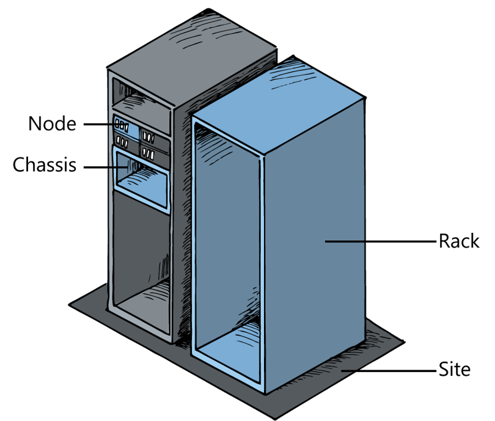

# Fault Domains and Host Failures

From a Windows Server 2016 perspective, you use fault domains to define components that all share a single point of failure. To achieve fault tolerance, which is closely related to fault domains, you must have multiple fault domains. Or in other words, you must not have a single point of failure. As an example, consider a four-node Windows Server 2016 cluster. Fault tolerance is provided at the node level. If one node in the cluster fails, the other three nodes will continue to provide the clustered services.

Fault domains become even more important when you are using blade servers. A blade server provides a cost-effective solution to hosting multiple nodes because they can all share the same chassis, which includes components such as the power supply and fans. However, the chassis is a fault domain. It is a single point of failure for all nodes that it serves. If the power supply fails, then all nodes will fail.

Windows Server 2016 is fault domain aware and includes support for the following levels of a Fault Domain:

- Site

- Rack

- Chassis

- Node

Storage Spaces Direct (S2D) is a good example of how fault domains are used in Windows Server 2016. S2D provides the ability to store data across multiple physical drives and nodes in a clustered environment. This provides fault tolerance not just for the data, but also the nodes to which the drives are attached. If you define fault domains at the rack level, S2D also ensures that data is duplicated to all drives, and nodes, in all racks as well.

When you are planning to use fault domains in Azure Stack, consider how Azure Stack manages fault tolerance for the hosts. As a minimum, there are four nodes in an Azure Stack deployment. This is typically known as a scale unit, and in Azure Stack, it is also known as a Fault Domain.

In a production deployment of Azure Stack, a scale unit can include up to 12 nodes. Therefore, if a single node fails, or even in a multinode failure scenario, Azure Stack continues to function because all nodes in the scale unit are clustered by using Failover Clustering services. Consider the following scenario when a cluster node fails in Azure Stack.

1. A node (host) in Azure Stack fails.

2. The node is evicted from the cluster and services continue to run across other nodes in the cluster. The cluster is scaled-in.

3. The Health Service resource provider generates an alert notifying the Cloud Operator of the node failure.

4. A ticket is raised with the helpdesk and a support engineer is assigned to resolve the problem.

5. The support engineer logs a support call with the hardware vendor.

6. The hardware vendor fixes or replaces the faulty node.

7. The node is added back into cluster management and the cluster is scaled-out.

8. The nodes storage is synchronized with the cluster and services continue to function as normal.

This replacement procedure for the node happens almost seamlessly because there is minimal configuration required after the node is replaced or repaired.

**Note:** You can use the Azure Stack reserved capacity as mentioned in Module 2 in such scenarios. You can substitute the capacity provided by the failed node with the clusters reserved capacity until the time the node is replaced or repaired.