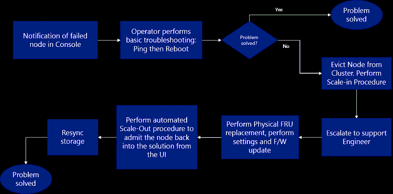

# Field Replaceable Unit

One of the key features in Azure Stack infrastructure components in the Field Replaceable Unit (FRU) feature. As will be described further in this lesson, FRP provides the ability for infrastructure components to be automatically replaced should they fail or become unstable. This is critical in ensuring that Azure Stack consistently provides the services and functionality to its end-users and customers alike.

In this lesson, you will learn about FRU in Azure Stack including key concepts and how it is implemented. You will also learn about Fault Domains and how you can use them to remove single points of failure in the Azure Stack infrastructure. Finally, you will learn how Azure Stack manages host failures both from Fault Domain perspective and from a general perspective.

After completing this section you will be able to:

- Describe the Field Replaceable Unit concept in Azure Stack.

- Describe Fault Domains in relation to host failures.

- Understand how Azure Stack deals with host failures.

## Overview of Field Replaceable Unit Concept

Before understanding how the FRU in Azure Stack is managed, you should first understand the general concept behind FRU. The following excerpt form an electrical perspective is a unit, circuit board, or chip that you can replace without having to replace the entire component. Additionally, you can replace the unit in-place, which means that you do not have to send the part or the component that it is a part of to be repaired.

When designing Azure Stack, Microsoft decided to adopt the FRU concept as and where possible. To understand this further, Microsoft defined the following design goals for Azure Stack.

- Assume that any part of the Azure Stack infrastructure can fail:

  - Azure Stack tools and procedures should be designed to work in a partially failed environment.

  - Procedures should be defined to allow for fast identification of failures and provide appropriate Mean Time to Recovery (MTR).

- Autonomous:

  - All software recovery procedures including firmware should be automatic.

  - Reduce the number of manual steps required to replace a physical component.

- Partner integration:

  - Work with partners who provide the hardware to ensure recovery procedures are defined appropriately.

  - Integrate recovery procedures with original equipment manufacturer’s (OEM) recovery procedures.

  - Ensure recovery workflows work in different customer environments.

The following diagram displays a typical workflow that is adopted in Azure Stack when an infrastructure component fails:

Using the preceding diagram above, consider the following scenario. A node in the Azure Stack environment fails and is offline. Using the workflow in the diagram, apply the following procedures:

1. The Cloud Operators receive an alert that notifies them of a component failure.

2. Basic troubleshooting is performed such as checking network connectivity and restarting the node.

3. If the problem is not resolved after step 2, the node is evicted from the cluster and the environment is scaled-in.

4. A ticket is raised and assigned to a support engineer, who will manage the problem moving forward.

5. A new node is added to the environment.

6. The node is added back into the cluster automatically and the environment is scaled-out.

The preceding example describes the workflow procedures that can take place in the event of a failed node in the Azure Stack infrastructure. There are many other workflows that you can utilize in other eventualities such as when a host failure occurs. This module covers host failures later.