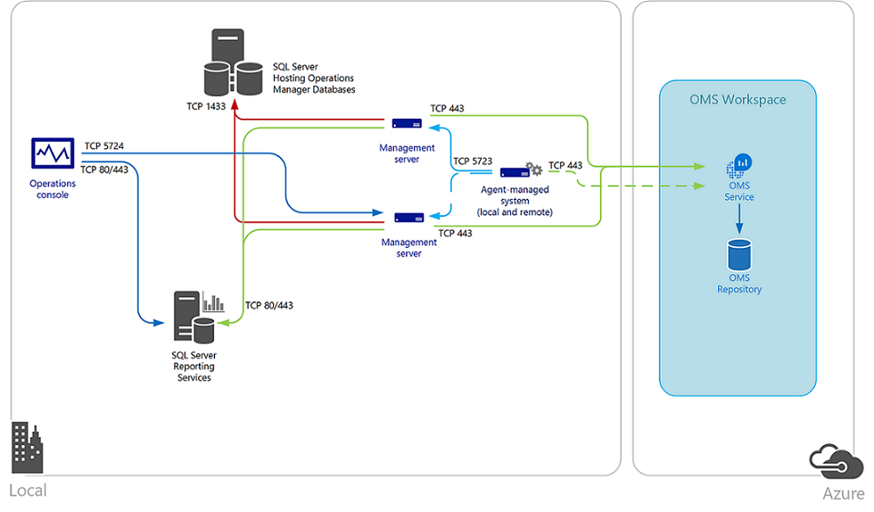

# Configuring Integration Between Operations Manager and OMS

In scenarios where customers (or tenants) already have deployed an Operations Manager Management Group but also want to use Operations Management Suite, they can choose to integrate Operations Manager with Operations Management Suite.

Configuring integration between Operations Manager and Operations Management Suite provides the ability for OMS to collect, store, and analyze data that Operations Manager has collected. When you configure integration, the Log Analytics solution in OMS is used to collect data from Operations Manager. This means that you can run reports and analyze data as you do with other data sources in OMS. Additionally, you also can use the dashboards available in OMS to visualize the data collected from Operations Manager.

In Operations Manager, management servers and agents collect the Log Analytics data, which is then sent to the OMS web service. If a management server fails, another management server in the management group continues to collect and send data to OMS. If the connection between the management server and OMS is lost, the management server caches data locally until the connection is reestablished. This ensures that the Log Analytics data is collected at all times. Furthermore, data that the Operations Manager collects for OMS is not stored in the Operations Manager databases. This is by design and helps ensure the Operations Manager databases continue to run optimally.

When you configure integration between Operations Manager and OMS, customers can continue to use the Operations Manager features as before.

To help understand how you configure integration between Operations Manager and OMS, review the following diagram:

## Configuring integration between Operations Manager and Operations Management Suite

The following high-level steps show how to configure integration between Operations Manager and Operations Management Suite:

1. In the Operations Manager console, navigate to the Administration workspace, expand the OMS node, and then click Connection.

2. Click the Register to Operations Management Suite link.

3. Provide the relevant information and sign in to your OMS subscription.

4. Connect to the required OMS workspace.

5. Complete the wizard and then from the Tasks pane, click Add Computer/Group.

6. Add the required agent-managed computers to be onboarded to OMS.

After you have configured the integration, you can confirm it has succeeded in OMS by performing the following steps:

1. In the OMS portal, click the Settings tile, and then click Connected Sources.

2. Under the System Center Operations Manager section, a table displays the connected Operations Manager management group including the number and status of agents reporting to OMS.

For more information about integrating Operations Manager with Operations Management Suite, refer to the following website: <https://aka.ms/moc-10995A-pg077>.