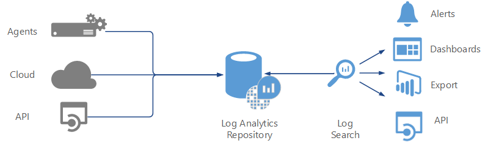

# Log Analytics

The Log Analytics service is probably the most used service in OMS because it provides the ability to collect, analyze, search, report, alert on, and export data from a wide variety of sources. Data could include events, performance data or custom data collected through its API. Support for both physical and virtual environments is provided.

Data sources can include Windows or Linux machines, Azure services, and virtual machines, or through the REST API that you can use to collect data from third-party applications and services. Log Analytics includes a powerful query language that you can use to filter and report any data it has collected across any data source. This makes searching and reporting on collected data simple and efficient. In addition, Log Analytics provides views and dashboards that you can use to visualize collected data.

Log Analytics also provides alerting by scheduling log searches or collected data. When a match is found, Log Analytics can send an email notification, start a runbook to automate a fix for the detected alert, or start a Webhook that you can use to pass information about the alert to another source, such as a website.

The following diagram shows how Log Analytics works in OMS:

