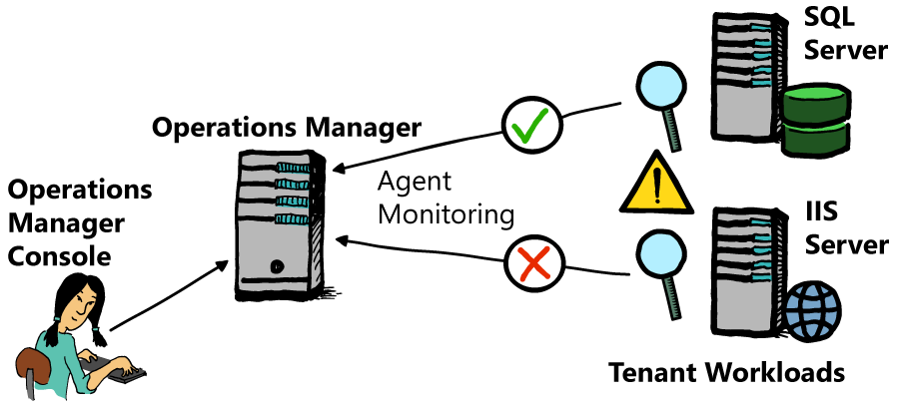

# Monitoring Guest Operating Systems and Applications with Operations Manager

Azure Stack tenants can use Operations Manager by deploying their own Operations Manager environment. You cannot install the Operations Manager agent on the Azure Stack infrastructure servers. But, because the Operations Manager agent is fully supported in a virtualized environment, you can install it in virtual machines. This brings the rich monitoring features and capabilities of Operations Manager to tenant workloads.

To facilitate this, tenants must configure an Operations Manager environment consisting of the following components that make up what is known as a Management Group.

- **SQL Server:** Used to host the Operations Manager Operational and Data Warehouse databases.

- **Management Server:** The server role in Operations Manager that is used to communicate with agents and the Operations Manager databases.

- **Reporting Server:** Used to build and present reports from the Operations Manager Data Warehouse database.

- **Operations Console:** Used to administer and operate Operations Manager.

- **Web Console:** Used to administer and operate Operations Manager through a web browser.

- **Agents:** Deployed to monitored computers that run rules and monitors to collect monitoring and performance data.

You can install all components of Operations Manager in a virtualized environment making it an ideal monitoring solution for tenants to adopt. Moreover, depending on the monitoring requirements and the number of monitored computers, you can install the core components of Operations Manager on a single computer. This provides an additional benefit to tenants because they would only need to pay for one virtual machine subscription.

As mentioned in the first topic in this lesson, Operations Manager utilizes Management Packs that provide default monitoring for most Microsoft applications. For most tenant workloads that run on the Windows Server operating system, this benefits the tenant greatly because they do not need to purchase additional Management Packs for monitoring Microsoft applications. For example, the following Management Packs are provided at no extra cost to use for Microsoft customers:

- Windows Server

- Active Directory Domain Services

- Dynamic Host Configuration Protocol (DHCP) Server

- Domain Name System (DNS) Server

- SQL Server

- SharePoint Server

- Microsoft Exchange Server

- Internet Information Services (IIS) Server

**Note:** This preceding list represents a small number of Management Packs available from Microsoft. For a full list of currently available Microsoft Management Packs, refer to the following website. <https://aka.ms/moc-10995A-pg076>.

For most tenants, the Management Packs available from Microsoft would fulfill all monitoring requirements. In cases where a Management Pack is not available, tenants can use the Management Pack Templates as described earlier to create their own monitors and rules that they can use to monitor their applications. Additionally, tenants can use the Operations Manager Authoring Tool to develop custom Management Packs. This is useful when developers want to include features such a console or agent tasks in a Management Pack that can then be used to diagnose and troubleshoot problems with the application being monitored.

Management Packs provide extensive monitoring for the application for which they were designed. Each Management Pack includes a Management Pack guide that describes how it works in Operations Manager, what (if anything) should be configured to enable it, and what is monitored in the application for which it was designed. This is useful because tenants can use the guide as a reference for what tenants can monitor with the management pack, and any special configuration that tenants must perform for the Management Pack to work appropriately in any environment.

Users might also find the company knowledge feature in Management Packs useful in Operations Manager. They can associate detailed information with rules and monitors that they can use to troubleshoot a problem detected. For example, this could include a TechNet article or a link to a known utility that tenants can use to fix the problem.