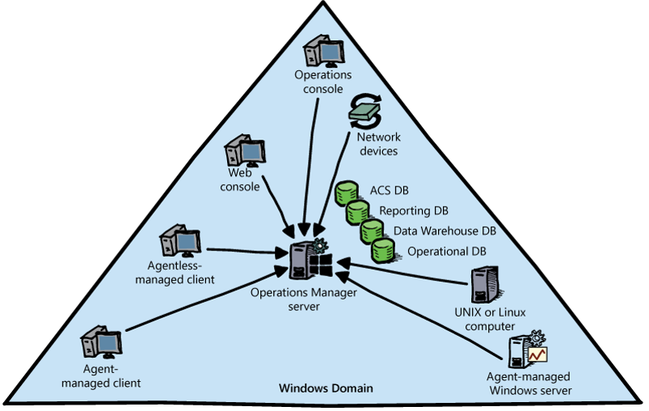

# Monitoring Guest Workloads in Microsoft Azure Stack

Monitoring the guest workloads, or applications, and services that users deploy, is not performed by Azure Stack. Therefore, it is important that users provide their own monitoring tools to ensure their applications and services are running at all times, and are performing optimally. For example, a service deployed by a user in Azure Stack might include a back-end database server, middle-tier application server, and a front-end web server. It is the responsibility of the user to ensure that the resources required by the applications are available, which includes the operating systems running on them. Therefore, it is important that you understand what options are available to users when monitoring their applications and services.

In this lesson, you will learn more about System Center Operations Manager and OMS. You will also learn how you can use Operations Manager to monitor guest workloads. Finally, you will learn how integration between Operations Manager and Operations Management Suite is performed and the functionality it provides.

After completing this section you will be able to:

- Describe System Center 2016 Operations Manager.

- Describe Operations Management Suite.

- Understand how you can use Operations Manager to monitor guest operating systems and applications.

- Configure the Operations Manager integration with Operations Management Suite.

## Overview of System Center 2016 Operations Manager

As mentioned earlier in this module, Operations Manager is an industry standard, comprehensive monitoring solution that provides support for both Windows and Linux or Unix operating systems, and also provides support for the hardware and networking infrastructure (physical and virtual) that they rely upon.

Operations Manager differs from other monitoring solutions in that although it can provide monitoring at the server level, it is better suited to monitor at the service level. To understand this, consider the following 3-tier application that consists of:

- A back-end database server running SQL Server.

- A middle-tier application server running Visual Studio.

- A front-end web server running Microsoft Internet Information Services (IIS).

Operations Manager monitors all aspects of each server, such as the SQL Server databases, the IIS websites and the Windows services. Moreover, Operations Manager also monitors the application holistically. This includes the operating systems, hardware such as the hard disks and memory, and also the networking infrastructure that is used for each server to communicate. Additionally, Operations Manager can also monitor what is known as the end-user perspective, which indicates how an application is performing from an end-user point of view. This could be simply running web tests to check that a website is available to running a complex set of tests from different locations to determine how a web application performs in different environments, with different networking infrastructure.

The ability of Operations Manager to monitor an application from end-to-end is called Distributed Application Diagrams. It also provides a single view to determine the health and availability of an application or service.

Operations Manager includes many features and capabilities that go beyond the scope of this course. As mentioned previously, there is a separate five-day course that you can take to fully understand how you can use Operations Manager to monitor the cloud and datacenter environment. The following sections describe some of the other key features available in Operations Manager.