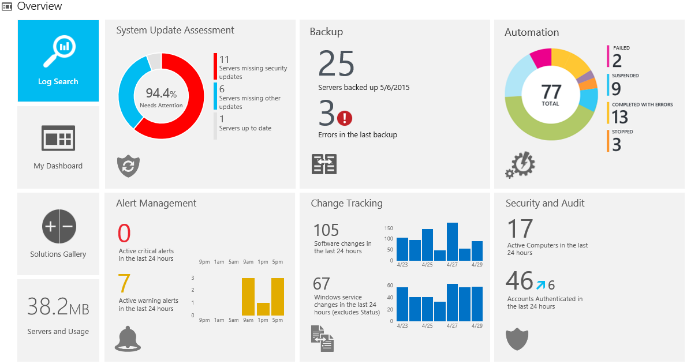

# Overview of Operations Management Suite

System Center components such as Operations Manager, Configuration Manager, and Data Protection Manager all require significant investment and resources to run them in your datacenter. With more and more resources being moved to the cloud, Microsoft realized that many of the features offered by these System Center components can also be provided from the cloud by using Operations Management Suite.

OMS is a fully hosted solution in Azure that includes several services. Although these services provide similar functionality to the System Center components mentioned before, they are designed specifically to run in a cloud environment. This removes the need for you to host the infrastructure and most of the administrative setup in your datacenter meaning you can configure OMS for your environment with very little effort. An agent is installed on the monitored systems similar to the Microsoft Monitoring Agent that is used in Operations Manager.

OMS provide a set of four management services that you can use singularly, or you can combine them to increase the functionality and capabilities of OMS. The following sections describe each of the four services available in OMS.