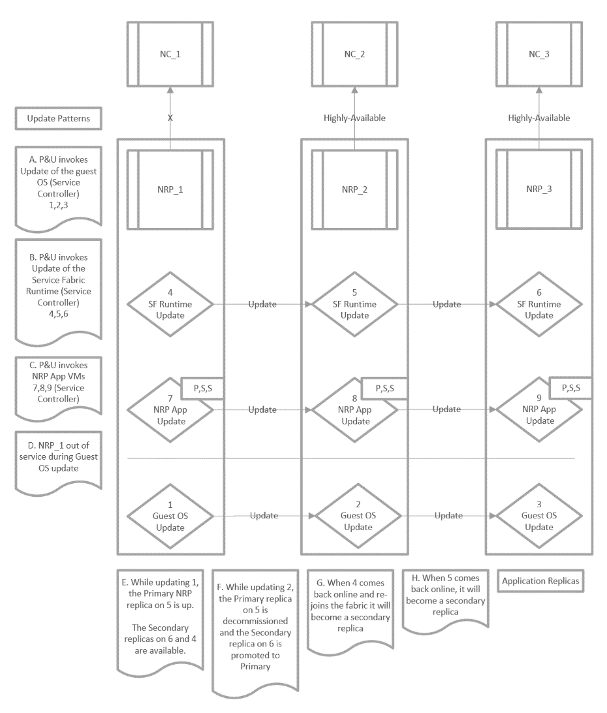

# Patching in Azure Stack

Microsoft has taken a similar approach to updating the Azure Stack environment as they did with the Cloud Platform System. One of the main goals in updating Azure Stack is to ensure that current workloads are not disrupted during the update process.

The update process for Azure Stack includes the following features:

- Infrastructure updates are applied while keeping applications, services, and user workloads highly available. This is made possible with features such as Live Migration, orchestration, and smart dependencies.

- Orchestration allows the update procedure to run automatically.

- Single update source with updates being released on specified schedule.

- All core components including hardware and software are included in the update process. This includes firmware, drivers, and configuration.

- Validation, reporting, and estimates of update timings are included.

Updates provided will include new functionality when it becomes available and improve existing features. However, all updates will not be supplied on a regular schedule as the following section describes:

- **Updates to content, tools, and services:** These types of updates are not scheduled and will be made available as and when they are ready. Updates of this type include Marketplace content, content from Microsoft Azure, and service updates. Typically, these types of updates are focused on improving the end-user features in Azure Stack.

- **Updates to the Azure Stack system:** These types of updates will be more regular and will include updates to the Azure Stack infrastructure such as firmware, drivers, and scale point expansion. These updates are focused on improving the overall operation of Azure Stack.

- **Security Updates:** These types of updates will be provided on a monthly basis and are intended to improve the security and authentication processes in Azure Stack.

Updates in Azure Stack is also managed with the Patch and Update (P&U) Engine. The following diagram illustrates an example of how the P&U Engine updates Azure Stack and the process for updating the Software Defined Networking (SDN) components in Azure Stack:

You can manage updates in Azure Stack by using the Updates blade. You manage updates by region, which can be useful in testing functionality after an update in one region before updates are applied to other regions. When you select a region in the Updates blade, the following information is displayed:

- Available Updates

- Name

- State

- Version

- Package Size

- Update History

- Name

- State

- Version

- Date Completed

When an update becomes available from Microsoft, it is displayed in the Available Updates section in the Azure Portal.

For updates that relate to hardware such as device drivers, or BIOS updates, these are packaged by the relevant OEM partner and then certified by Microsoft before they are made available as updates to the Azure Stack infrastructure. Some of these updates might need to be applied out-of-band (OOB) from the normal update release cycle. This could include security fixes or emergency updates to fix a known issue.