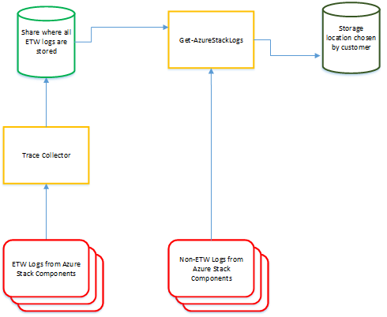

# Using Azure Stack Diagnostic Tools

Because Azure Stack is comprised of several separate components that work together to provide Azure Stack features, it can be a time-consuming task to collect and correlate logs from each component when troubleshooting. For this reason, Microsoft has provided diagnostic tools that you can use to collect all relevant logs and store them in a location that is accessible to the Azure Stack Cloud Operator. The following sections describe the diagnostic tools available in Azure Stack.

