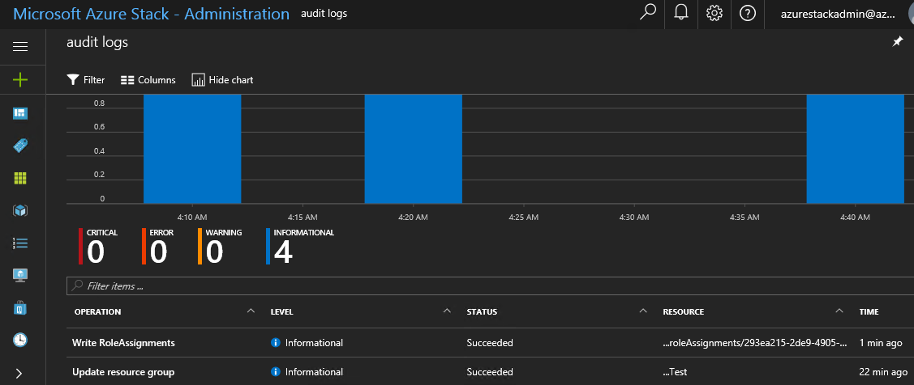

# Using the Audit Logs

The Azure Stack Audit Logs provide detailed logging for each subscription in Azure Stack. Events logged fall into one of the following four categories:

- **Informational**

- **Warning**

- **Error**

- **Critical**

You can access the Audit Logs from within the Azure Stack Portal by clicking More Services. In the services list, under the Management + Security section, the Audit Logs item is displayed. When opening the Audit Logs blade, you are presented with a filtered list of events that relate to all subscriptions, all categories, and all events. Included at the top of the page is a bar chart that shows graphically, the number of events over the selected time period. This is useful because you can see at a glance on which day the most number of events were generated, such as Critical or Warning events. You can then correlate this with other events that might have occurred in the environment, such as maintenance or planned downtime.

Under the bar chart, each event is displayed based on the configured filter. For each event, the following information is included by default:

- **Operation:** The operation that generated the event.

- **Level:** The event level such as Informational or Warning.

- **Status:** The status of the operation such as failed or succeeded.

- **Resource:** The resource related to the operation and event.

- **Time:** The time that the event was generated.

When you click an event, the blade expands to show further information, which can include other related events. For example, when you update a Storage Group in Azure Stack, an Audit Log Informational event is logged with the name Update Storage Log. When you click this event, two additional related events are displayed: one for the update process starting and another showing the update process completing. Additional information included in the expanded blade shows the Caller, which in this case, is the Azure Stack user ID. This is useful because it provides the ability to tie events to specific users, who are performing actions in Azure Stack. When you click a related (or correlated) event, the blade expands again to display further information such as the Event Timestamp, Resource URI, and Subscription ID. You can use this information with other event information to determine how the event was triggered, by which user, and exactly when the event was generated.

You can optionally archive audit logs to a Storage Account or stream them to a Storage Event Hub. Storage Event Hubs in Azure provide a method of collecting and storing millions of events per second and are typically used in big data scenarios. For more information about Event Hubs in Azure, refer to the following website: <https://aka.ms/moc-10995A-pg078>.

You can use the Filter button in the Audit Logs blade to filter events displayed. This is useful if you are interested in events that have occurred within a specific time-span or of a specific severity such as Critical or Warning events. You can Filter events based on the following properties:

- Subscription

- Resource group

- Resource type

- Resource

- Event category

- Level

- Time span

- Caller

In addition to filtering the list of displayed events, you can also find events by typing part of the operation name in the filter bar at the top of the page. You can do this if you want to display all events that relate to a particular operation such as an update operation for example.