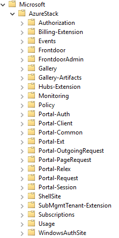

# Using the Windows Event Log

Azure Stack logs a significant amount of information to the Windows Event Log, which include details of day-to-day operations in addition to errors and warning for events affecting the Azure Stack environment.

**Note:** Note that the Event Log troubleshooting content referenced in this topic relates to the Azure Stack Development Kit. In a production deployment of Azure Stack, the event logs are restricted for security reasons.

You can access the event logs by using the Event Viewer on the host computer and then connecting to the relevant event log on the infrastructure server in which you are interested. You can do this by using the Connect to Another Computer option that is made available when you right-click the Event Viewer node.

In addition to the standard event logs such as the Application, System, and Security event logs, Azure Stack records specific events relating to infrastructure components under the Applications and Services Logs node in Event Viewer. For example, on the AzS-WAS01 virtual machine, the following logs are included:

Because the AzS-WAS01 virtual machine is used to host the Azure Stack Portal and Resource Manager services, if there are any problems relating to these components in Azure Stack, you should review these logs for relevant error or warning events.