# Add an App Service resource provider to Azure Stack

You can give your users the ability to create web and API applications. To let users create these applications, you need to:

- Add the [App Service resource provider](https://docs.microsoft.com/en-us/azure/azure-stack/azure-stack-app-service-overview) to your Azure Stack deployment using the steps described in this article.

- After you install the App Service resource provider, you can include it in your offers and plans. Users can then subscribe to get the service and start creating applications.

**Note:** Before you run the resource provider installer, make sure that you've followed the guidance in [Before you get started](https://docs.microsoft.com/en-us/azure/azure-stack/azure-stack-app-service-before-you-get-started)

## Run the App Service resource provider installer

Installing the App Service resource provider takes at least an hour. The length of time needed depends on how many role instances you deploy. During the deployment, the installer runs the following tasks:

- Create a blob container in the specified Azure Stack storage account.
- Create a DNS zone and entries for App Service.
- Register the App Service resource provider.
- Register the App Service gallery items.

To deploy App Service resource provider, follow these steps:

1. Run appservice.exe as an administrator from a computer that can access the Azure Stack Admin Azure Resource Management Endpoint.

2. Select **Deploy App Service or upgrade to the latest version**.

    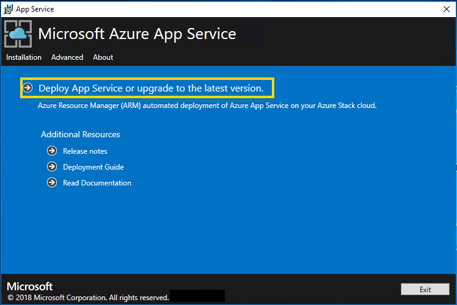

3. Review and accept the Microsoft Software License Terms and then select **Next**.

4. Review and accept the third-party license terms and then select **Next**.

5. Make sure that the App Service cloud configuration information is correct. If you used the default settings during Azure Stack Development Kit (ASDK) deployment, you can accept the default values. But, if you customized the options when you deployed the ASDK, or are deploying on an Azure Stack integrated system, you must edit the values in this window to reflect the differences.

   For example, if you use the domain suffix mycloud.com, your Azure Stack Tenant Azure Resource Manager endpoint must change to management.&lt;region&gt;.mycloud.com. Review these settings, and then select **Next** to save the settings.

    

6. On the next App Service Installer page, follow these steps:

    a. Select **Connect** next to the **Azure Stack Subscriptions**.

   - If you're using Azure Active Directory (Azure AD), enter the Azure AD admin account and password that you provided when you deployed Azure Stack. Select **Sign In**.
   - If you're using Active Directory Federation Services (AD FS), provide your admin account. For example, cloudadmin@azurestack.local. Enter your password, and then select **Sign In**.

   b. In **Azure Stack Subscriptions**, select the **Default Provider Subscription**.

     > [!IMPORTANT]  
     > App Service **must** be deployed to the **Default Provider Subscription**.

   c. In the **Azure Stack Locations**, select the location that corresponds to the region you're deploying to. For example, select **local** if your deploying to the Azure Stack Development Kit.

    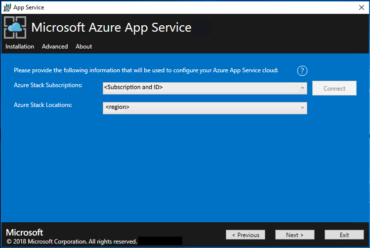

7. Now you can deploy into an existing virtual network that you configured [using these steps](azure-stack-app-service-before-you-get-started.md#virtual-network), or let the App Service installer create a new virtual network and subnets. To create a VNet, follow these steps:

   a. Select **Create VNet with default settings**, accept the defaults, and then select **Next**.

   b. Alternatively, select **Use existing VNet and Subnets**. Complete the following actions:

     - Select the **Resource Group** that contains your Virtual Network.
     - Choose the **Virtual Network** name that you want to deploy to.
     - Select the correct **Subnet** values for each of the required role subnets.
     - Select **Next**.

    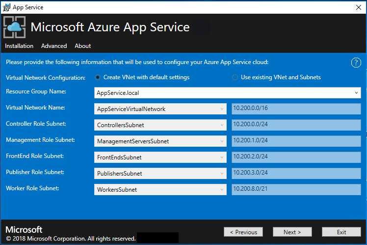

8. Enter the information for your file share and then select **Next**. The address of the file share must use the Fully Qualified Domain Name (FQDN), or the IP address of your File Server. For example, \\\appservicefileserver.local.cloudapp.azurestack.external\websites, or \\\10.0.0.1\websites.  If you are using a file server which is domain joined, you must provide the full username including domain, for example, myfileserverdomain\FileShareOwner.

   >[!NOTE]
   >The installer tries to test connectivity to the file share before proceeding. But, if you're deploying to an existing virtual network, this connectivity test might fail. You're given a warning and a prompt to continue. If the file share information is correct, continue the deployment.

    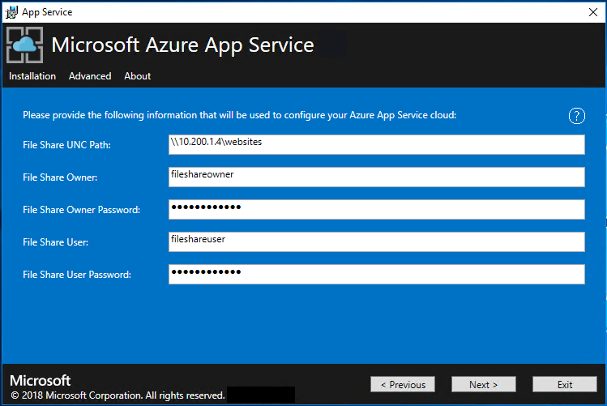

9. On the next App Service Installer page, follow these steps:

   a. In the **Identity Application ID** box, enter the GUID for the application you’re using for identity (from Azure AD).

   b. In the **Identity Application certificate file** box, enter (or browse to) the location of the certificate file.

   c. In the **Identity Application certificate password** box, enter the password for the certificate. This password is the one that you made note of when you used the script to create the certificates.

   d. In the **Azure Resource Manager root certificate file** box, enter (or browse to) the location of the certificate file.

   e. Select **Next**.

    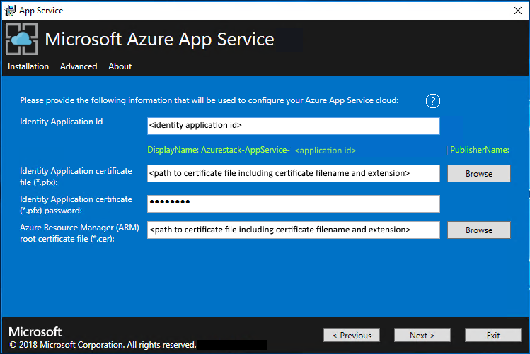

10. For each of the three certificate file boxes, select **Browse** and navigate to the appropriate certificate file. You must provide the password for each certificate. These certificates are the ones that you created in the [Create required certificates step](azure-stack-app-service-before-you-get-started.md#get-certificates). Select **Next** after entering all the information.

    | Box | Certificate file name example |
    | --- | --- |
    | **App Service default SSL certificate file** | \_.appservice.local.AzureStack.external.pfx |
    | **App Service API SSL certificate file** | api.appservice.local.AzureStack.external.pfx |
    | **App Service Publisher SSL certificate file** | ftp.appservice.local.AzureStack.external.pfx |

    If you used a different domain suffix when you created the certificates, your certificate file names don’t use *local.AzureStack.external*. Instead, use your custom domain information.

    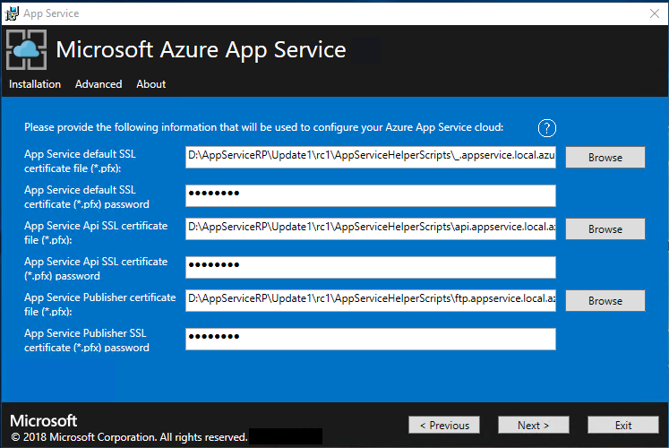

11. Enter the SQL Server details for the server instance used to host the App Service resource provider databases and then select **Next**. The installer validates the SQL connection properties.  The App Service installer tries to test connectivity to the SQL Server before proceeding. If you're deploying to an existing virtual network, this connectivity test might fail. You're given a warning and a prompt to continue. If the SQL Server information is correct, continue the deployment.

    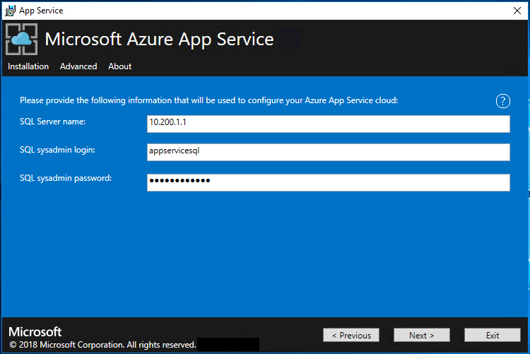

12. Review the role instance and SKU options. The defaults populate with the minimum number of instances and the minimum SKU for each role in an ASDK Deployment. A summary of vCPU and memory requirements is provided to help plan your deployment. After you make your selections, select **Next**.

    >[!NOTE]
    >For production deployments, following the guidance in [Capacity planning for Azure App Service server roles in Azure Stack](azure-stack-app-service-capacity-planning.md).

    | Role | Minimum instances | Minimum SKU | Notes |
    | --- | --- | --- | --- |
    | Controller | 1 | Standard_A2 - (2 vCPU, 3584 MB) | Manages and maintains the health of the App Service cloud. |
    | Management | 1 | Standard_A2 - (2 vCPUs, 3584 MB) | Manages the App Service Azure Resource Manager and API endpoints, portal extensions (admin, tenant, Functions portal), and the data service. To support failover, increased the recommended instances to 2. |
    | Publisher | 1 | Standard_A1 - (1 vCPU, 1792 MB) | Publishes content via FTP and web deployment. |
    | FrontEnd | 1 | Standard_A1 - (1 vCPU, 1792 MB) | Routes requests to App Service applications. |
    | Shared Worker | 1 | Standard_A1 - (1 vCPU, 1792 MB) | Hosts web or API applications and Azure Functions apps. You might want to add more instances. As an operator, you can define your offering and choose any SKU tier. The tiers must have a minimum of one vCPU. |

    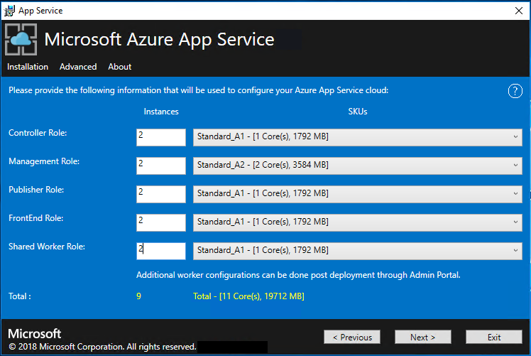

    >[!NOTE]
    >**Windows Server 2016 Core isn't a supported platform image for use with Azure App Service on Azure Stack.  Don't use evaluation images for production deployments.**

13. In the **Select Platform Image** box, choose your deployment Windows Server 2016 virtual machine image from the images available in the compute resource provider for the App Service cloud. Select **Next**.

14. On the next App Service Installer page, follow these steps:

     a. Enter the Worker Role virtual machine administrator user name and password.

     b. Enter the Other Roles virtual machine administrator user name and password.

     c. Select **Next**.

    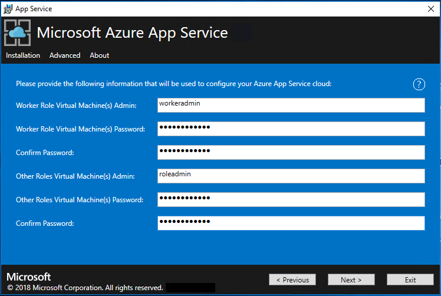

15. On the App Service Installer summary page, follow these steps:

    a. Verify the selections you made. To make changes, use the **Previous** buttons to visit previous pages.

    b. If the configurations are correct, select the check box.

    c. To start the deployment, select **Next**.

    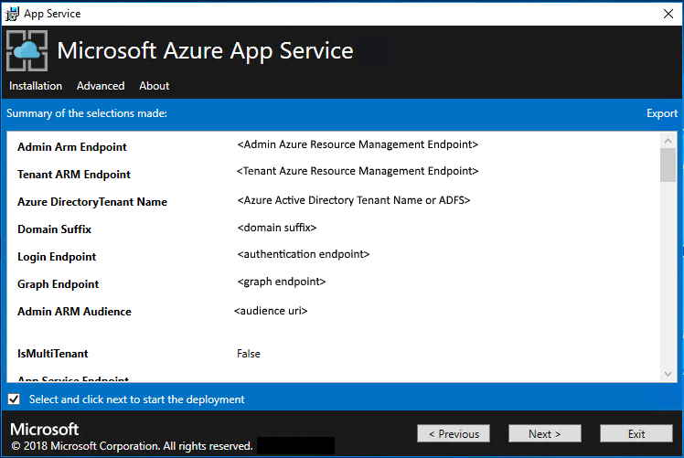

16. On the next App Service Installer page, follow these steps:

    a. Track the installation progress. App Service on Azure Stack takes about 60 minutes to deploy based on the default selections.

    b. After the installer successfully finishes, select  **Exit**.

    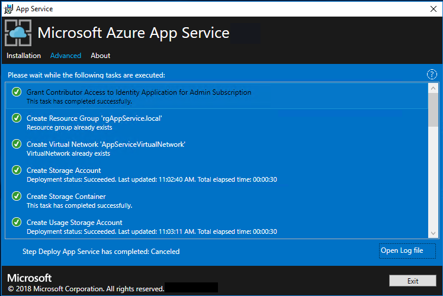

## Post-deployment Steps

> [!IMPORTANT]  
> If you have provided the App Service RP with a SQL Always On Instance you MUST [add the appservice_hosting and appservice_metering databases to an availability group](https://docs.microsoft.com/sql/database-engine/availability-groups/windows/availability-group-add-a-database) and synchronize the databases to prevent any loss of service in the event of a database failover.

## Validate the App Service on Azure Stack installation

1. In the Azure Stack admin portal, go to **Administration - App Service**.

2. In the overview, under status, check to see that the **Status** displays **All roles are ready**.

    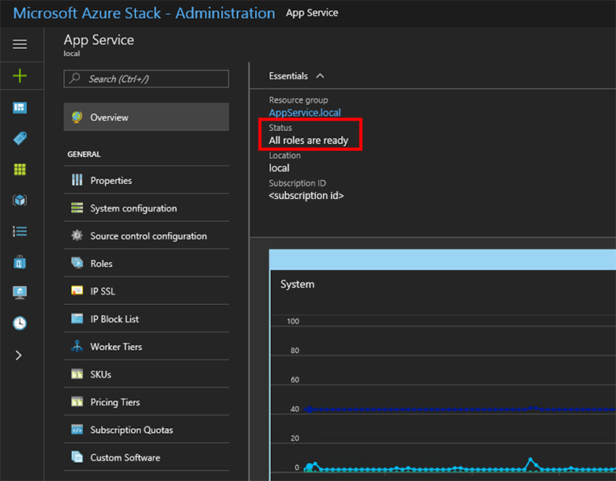

    If you're deploying to an existing virtual network and using an internal IP address to connect to your file server, you must add an outbound security rule. This rule enables SMB traffic between the worker subnet and the file server.  To do this, go to the WorkersNsg in the Admin Portal and add an outbound security rule with the following properties:

    - Source: Any
    - Source port range: *
    - Destination: IP Addresses
    - Destination IP address range: Range of IPs for your file server
    - Destination port range: 445
    - Protocol: TCP
    - Action: Allow
    - Priority: 700
    - Name: Outbound_Allow_SMB445

## Test drive App Service on Azure Stack

After you deploy and register the App Service resource provider, test it to make sure that users can deploy web and API apps.

>[!NOTE]
>You need to create an offer that has the Microsoft.Web namespace in the plan. You also need a tenant subscription that subscribes to the offer. For more information, see [Create offer](https://docs.microsoft.com/en-us/azure/azure-stack/azure-stack-create-offer) and [Create plan](https://docs.microsoft.com/en-us/azure/azure-stack/azure-stack-create-plan).
>
>You *must* have a tenant subscription to create applications that use App Service on Azure Stack. The only tasks that a service admin can complete in the admin portal are related to the resource provider administration of App Service. This includes adding capacity, configuring deployment sources, and adding Worker tiers and SKUs.
>
>To create web, API, and Azure Functions apps, you must use the tenant portal and have a tenant subscription.
>

To create a test web app, follow these steps:

1. In the Azure Stack user portal, select **+ Create a resource** > **Web + Mobile** > **Web App**.

2. Under **Web App**, enter a name in **Web app**.

3. Under **Resource Group**, select **New**. Enter a name for  the **Resource Group**.

4. Select **App Service plan/Location** > **Create New**.

5. Under **App Service plan**, enter a name for the **App Service plan**.

6. Select **Pricing tier** > **Free-Shared** or **Shared-Shared** > **Select** > **OK** > **Create**.

7. A tile for the new web app appears on the dashboard. Select the tile.

8. On **Web App**, select **Browse** to view the default website for this app.

## Deploy a WordPress, DNN, or Django website (optional)

1. In the Azure Stack tenant portal, select **+**, go to the Azure Marketplace, deploy a Django website, and then wait for the deployment to finish. The Django web platform uses a file system-based database. It doesn’t require any additional resource providers, such as SQL or MySQL.

2. If you also deployed a MySQL resource provider, you can deploy a WordPress website from the Marketplace. When you're prompted for database parameters, enter the user name as *User1\@Server1*, with the user name and server name of your choice.

3. If you also deployed a SQL Server resource provider, you can deploy a DNN website from the Marketplace. When you're prompted for database parameters, choose a database in the computer running SQL Server that's connected to your resource provider.