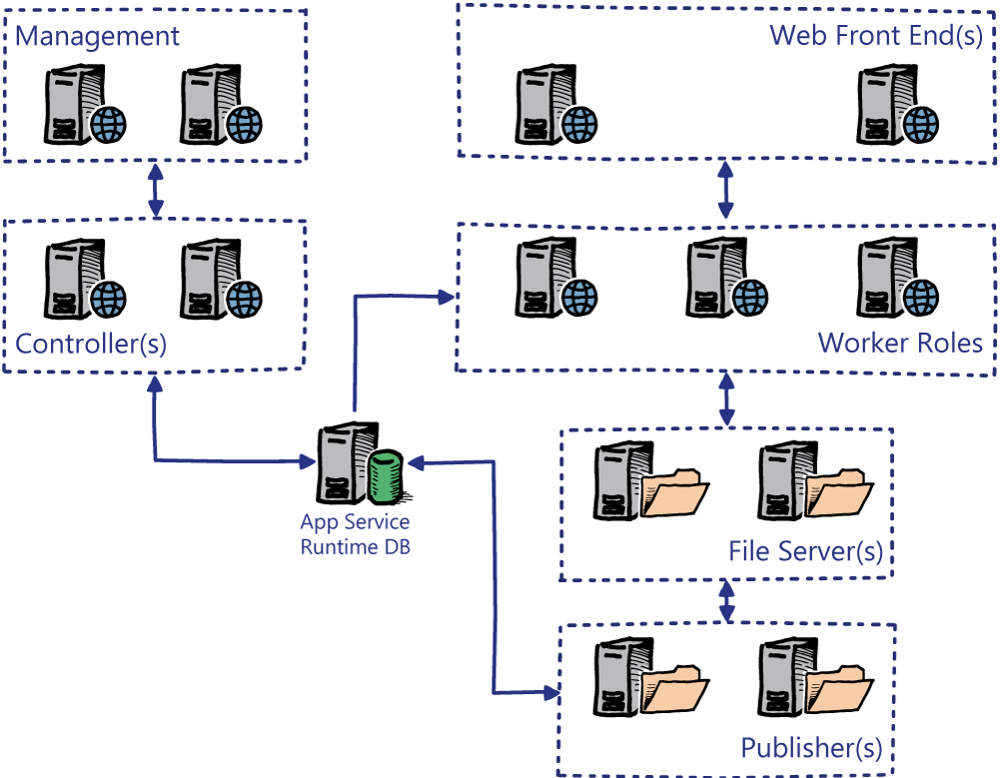

# Overview of App Service Resource Provider

In this lesson you will learn about the App Service resource provider. Azure App Service on Azure Stack is a platform-as-a-service (PaaS) offering of Microsoft Azure available to Azure Stack. The service lets your customers - internal or external - create web, API, and Azure Functions applications for any platform or device. They can integrate your apps with on-premises applications and automate their business processes. Azure Stack cloud operators can run customer apps on fully managed virtual machines (VMs), with their choice of shared VM resources or dedicated VMs.  

Azure App Service includes capabilities for automating business processes and hosting cloud APIs. As a single integrated service, Azure App Service lets you compose various components -- websites, RESTful APIs, and business processes -- into a single solution.

You will learn how to install the App Service resource provider, configure it, and deploy additional roles within it for user consumption.

## Why offer Azure App Service on Azure Stack?

Here are some key features and capabilities of App Service:

- **Multiple languages and frameworks:** App Service has first-class support for ASP.NET, Node.js, Java, PHP, and Python. You can also run Windows PowerShell and other scripts or executables on App Service VMs.

- **DevOps optimization:** Set up continuous integration and deployment with GitHub, local Git, or BitBucket. Promote updates through test and staging environments. Manage your apps in App Service by using Azure PowerShell or the cross-platform command-line interface (CLI).

- **Visual Studio integration:** Dedicated tools in Visual Studio streamline the work of creating and configuring apps in App Service.

## App types in App Service

App Service offers several app types, each of which is intended to host a specific workload:

- Web Apps for hosting websites and web applications.

- API Apps for hosting RESTful APIs.

- Azure Functions for hosting event driven, serverless workloads.

The word 'app' here refers to the hosting resources dedicated to running a workload. Taking “web app” as an example, you’re probably accustomed to thinking of a web app as both the compute resources and application code that together deliver functionality to a browser. But in App Service a web app is the compute resources that Azure Stack provides for hosting your application code.  

Your application can be composed of multiple App Service apps of different kinds. For example, if your application is composed of a web front end and a RESTful API back end, you can:

- Deploy both (front end and API) to a single web app

- Deploy your front-end code to a web app and your back-end code to an API app

After completing this section you will be able to:

- Describe the features and functionality of the App Service resource provider.

- Install the App Service resource provider.

- Configure the App Service resource provider.

- Know how to add additional capacity to the App Service resource provider for user consumption

Users can use the App Service resource provider to create web applications, mobile application back ends, RESTful APIs, and more. It is designed to help solve many of the problems faced by web developers by focusing on delivering web hosting at the cloud scale.

It provides the features and frameworks that are required for building, deploying, and maintaining enterprise-level applications. You can use many popular development platforms and languages including Java, PHP, Node.js, Python, and the Microsoft .NET Framework languages.

The App Service resource provider is a PaaS-based service that is deployed and maintained by the Azure Stack Cloud Operator. The users consume the service, in this instance Microsoft Internet Information Services (IIS) web hosting, and do not have access to the underlying virtual machine infrastructure.

When you deploy the App Service Resource Provider in Azure Stack, it creates the following infrastructure for you:

- **Website Controller:** This role server is responsible for provisioning and managing the other roles in the App Service.

- **Management:** This role is the App Service REST API that Azure Stack uses.

- **Front-End:** This role accepts the inbound HTTP/HTTPS requests from consumers of the web app, it routes the request to the worker server where the web app is being executed and returns responses from the worker to the client.

- **Publisher:** This role is responsible for publishing the DevOps-created content for web apps. It is the File Transfer Protocol (FTP) endpoint and is responsible for integration with code repositories such as GitHub.

- **Worker (in Shared mode):** This role is responsible for executing the web app that the client is connecting to.

- **File Server:** This stores the content for each web app that is uploaded to App Service. The worker roles obtain the required files for the web app from this role.

It is possible to scale these instances to meet the requirements of the App Service resource provider. As with all other Resource Providers, it is down to the Azure Stack Cloud Architect to decide in which Azure Stack Regions it will be deployed to. In addition to the Roles above, a database is provisioned within the SQL Resource Provider, as such this will be required.