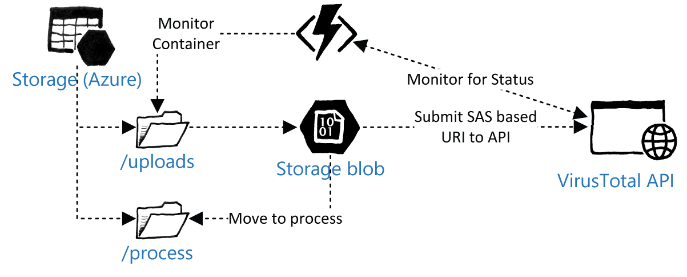

# An Example Azure Stack Function

This topic illustrates an example Azure Stack Function that uses a Blob Trigger. This function will perform the following tasks:

1. Monitor the container for an uploaded blob using a Blob Trigger.

2. Create a Shared Access Signature (SAS) token to grant external access to the blob URI.

3. Using this URI, the function will submit the URI to VirusTotal’s API for analysis of the file to ensure it is free of malware.

4. If the file is clean, the function will move the file to another container where the file is ready to be processed. This could potentially be another Azure Function. If the file is not clean, the function deletes the file.



This solution is on GitHub from the repo 'Genbox/VirusTotal.Net: A full implementation of the VirusTotal 2.0 API' <https://aka.ms/moc-10995A-az13>. It was compiled in Microsoft Visual Studio 2017 and the resultant DLL file uploaded to the /bin folder within the function app root.

**Note:** To use this example, you will require a VirusTotal API key. You can obtain this by registering with Virus Total. For this example, the API Key was added to the App Service Environment as a Configuration Setting.

This is the example code that was created in Azure Stack Functions for the required task:

```csharp
#r "Microsoft.WindowsAzure.Storage"
#r "VirusTotal.Net.dll"
#r "Newtonsoft.Json.dll"
using System.Net;
using System.Configuration;
using Microsoft.WindowsAzure.Storage;
using Microsoft.WindowsAzure.Storage.Blob;
using VirusTotalNET;
using VirusTotalNET.Results;
public ../../Linked_Image_Files void Run(Stream myBlob, string name, TraceWriter log)
{
log.Info($"BlobTrigger function Processed blob\n Name: {name} \n Size: {myBlob.Length} Bytes");
// Creating a Shared Access Signature URI for use with VirusTotal.com API
var permissions = SharedAccessBlobPermissions.Read; // default to read permissions
var storageAccount = CloudStorageAccount.Parse(ConfigurationManager.AppSettings["AzureWebJobsStorage"]);
var blobClient = storageAccount.CreateCloudBlobClient();
var container = blobClient.GetContainerReference("uploads");
var sasToken = 
name != null ?
GetBlobSasToken(container, name, permissions) : 
GetContainerSasToken(container, permissions);
string retURI = (container.Uri + "/" + name + sasToken);
// Uncomment to show the SAS URI
//log.Info($"SAS URI:\n{retURI}");
//create a Task to Scan the SAS URI
var task = RunScan(retURI, log);
task.Wait(); // Blocks current thread until RunScan is complete
// Create object for the blob
CloudBlockBlob sourceBlob = container.GetBlockBlobReference(name);
if(task.Result.Positives > 0)
{
// found malware
log.Info($"Malware detected, deleting: {name}");
sourceBlob.Delete();
} else
{
log.Info($"No Malware in: {name}");
// clean, move to "/process" container
var processContainer = blobClient.GetContainerReference("process");
CloudBlockBlob destBlob = processContainer.GetBlockBlobReference(name);
// copy the blob to the process container
CopyBlob(sourceBlob, destBlob, log);
//task.Wait(); // Blocks current thread until CopyBlob is complete
// Delete the Source Blob
sourceBlob.Delete();
}
}
private ../../Linked_Image_Files async Task<UrlReport> RunScan(string URI, TraceWriter log)
{
// Create new instance of VirusTotal Class using the Key in App Settings 
VirusTotal virusTotal = new VirusTotal(ConfigurationManager.AppSettings["VT_API_KEY"]);
virusTotal.UseTLS = true;
// Scan the required URL
UrlReport urlReport = await virusTotal.GetUrlReport(URI);
// Return the number of positives 
return urlReport;
}
private ../../Linked_Image_Files bool CopyBlob(CloudBlockBlob sourceBlob, CloudBlockBlob destBlob, TraceWriter log)
{
// Copy the sourceBlob to the destBlob
destBlob.StartCopy(sourceBlob);
while (destBlob.CopyState.Status == CopyStatus.Pending)
{
System.Threading.Thread.Sleep(500);
}
if (destBlob.CopyState.Status != CopyStatus.Success)
{
throw new Exception("Copy failed: " + destBlob.CopyState.Status);
} else {
return true;
}
}
public ../../Linked_Image_Files string GetBlobSasToken(CloudBlobContainer container, string blobName, SharedAccessBlobPermissions permissions, string policyName = null)
{
string sasBlobToken;
// Get a reference to a blob within the container.

// Note that the blob may not exist yet, but a SAS can still be created for it.
CloudBlockBlob blob = container.GetBlockBlobReference(blobName);
if (policyName == null) {
var adHocSas = CreateAdHocSasPolicy(permissions);
// Generate the shared access signature on the blob, setting the constraints directly on the signature.
sasBlobToken = blob.GetSharedAccessSignature(adHocSas);
}
else {
// Generate the shared access signature on the blob. In this case, all of the constraints for the
// shared access signature are specified on the container's stored access policy.
sasBlobToken = blob.GetSharedAccessSignature(null, policyName);
} 
return sasBlobToken;
}
public ../../Linked_Image_Files string GetContainerSasToken(CloudBlobContainer container, SharedAccessBlobPermissions permissions, string storedPolicyName = null)
{
string sasContainerToken;
// If no stored policy is specified, create a new access policy and define its constraints.
if (storedPolicyName == null) {
var adHocSas = CreateAdHocSasPolicy(permissions);
// Generate the shared access signature on the container, setting the constraints directly on the signature.
sasContainerToken = container.GetSharedAccessSignature(adHocSas, null);
}
else {
// Generate the shared access signature on the container. In this case, all of the constraints for the
// shared access signature are specified on the stored access policy, which is provided by name.
// It is also possible to specify some constraints on an ad-hoc SAS and others on the stored access policy.
// However, a constraint must be specified on one or the other; it cannot be specified on both.
sasContainerToken = container.GetSharedAccessSignature(null, storedPolicyName);
}
return sasContainerToken;
}
private ../../Linked_Image_Files SharedAccessBlobPolicy CreateAdHocSasPolicy(SharedAccessBlobPermissions permissions)
{
// Create a new access policy and define its constraints.
// Note that the SharedAccessBlobPolicy class is used both to define the parameters of an ad-hoc SAS, and 
// to construct a shared access policy that is saved to the container's shared access policies. 
return new SharedAccessBlobPolicy() {
// Set start time to five minutes before now to avoid clock skew.
SharedAccessStartTime = DateTime.UtcNow.AddMinutes(-5),
SharedAccessExpiryTime = DateTime.UtcNow.AddHours(1),
Permissions = permissions
};
}
```

This preceding piece of code performs all of the required actions listed mentioned before. By having this code run as an Azure Function, you can modify it very easily. Additionally, this function works in both Azure and Azure Stack.