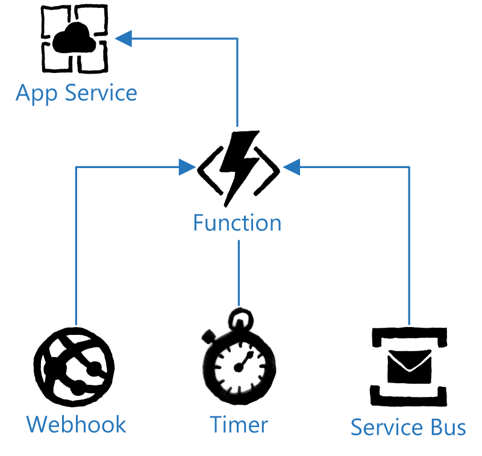

# Azure Functions Overview

In this lesson, you will learn about Azure Functions and the concept of serverless compute within Azure Stack. You can use Azure Functions in a microservices-orientated application architecture to perform numerous actions based on a trigger condition.

After completing this lesson, you will be able to:

- Understand Azure Functions

- Use Azure Functions

You can use Azure Functions to write small pieces of code, referred to as a function that can be run without having to provision infrastructure for the execution of the code. This is known as serverless compute.

Serverless compute is a term for a scenario where the underlying infrastructure that the service requires is abstracted from the consumer of the service. The consumer of the service is unaware of what compute resources the service is reliant upon. By removing the concern of the underlying infrastructure, serverless compute can allow consumers of these services to drive business value from the services, which can lead to a faster time to implementation. An example of serverless function in Azure is Azure AD The underlying infrastructure that Azure AD operates on is abstracted from the service it provides allowing for the consumption of the resource to be the focus rather than the underlying components.

The core idea behind Azure Functions is to enable microservices-based applications, where an application is comprised of many different components, each responsible for its own task. You can write functions in a variety of languages such as C#, F#, Node.js, and various others. This allows you to take advantage of the power of Azure Functions without having to learn a new programming language. Each function you create requires a trigger to run the function.