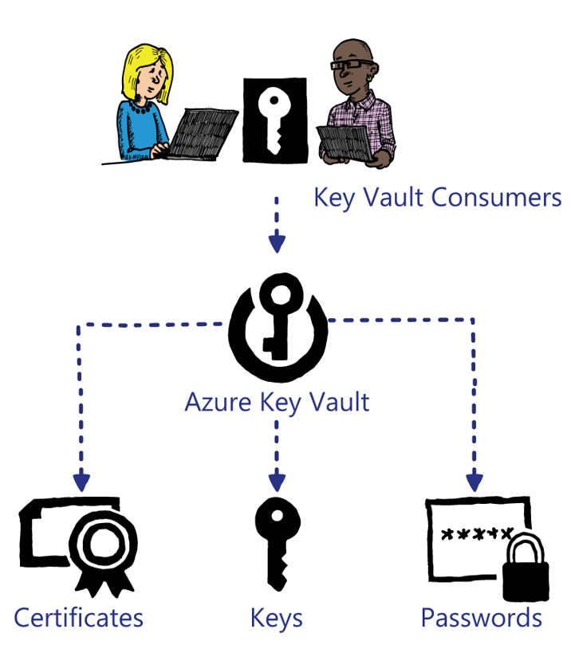

# Key Vault Overview

In this module you will learn about Azure Key Vault, its capabilities, and potential usage scenarios. Azure Key Vault is designed as a centralized secret store primarily for use with Azure technologies but you can use it for other scenarios as required.

- After completing this module you will be able to:

- Describe what Azure Key Vault is.

- Understand possible Azure Key Vault usages.

- Understand how to use secrets stored in Key Vault with Azure Resource Manager Templates.

Azure Stack offers the Key Vault, which can store cryptographic keys and secrets that Cloud-based applications and services can consume. Examples of keys and secrets that the Key Vault can store are:

- Storage Account keys (as discussed in Module 6)

- Shared Access Signature URIs (as discussed in Module 6)

- Usernames

- Passwords

- License keys

- Certificate PFX files

- License files

- SQL connection strings

These are all stored in an encrypted format and are only accessible through Key Vault.

Various individuals or teams within an organization can create, consume, and manage the secrets and keys, while maintaining a full audit history of actions. This can assist with auditing and compliance regulations.

Security administrators can fully manage permissions on a Key Vault to determine who, or what, can access the secrets and keys. You can give Azure Resource Manager access to the Vault so that the Azure Resource Manager can utilize the values stored within during provisioning. One example could be the local Administrator password for a virtual machine, which is required during provisioning. However, you do not want to give that password to provisioning users. In such a case, you can reference a Key Vault secret in the parameters file for an Azure Resource Manager template deployment without having to grant access to the provisioning user.

The keys and secrets stored in the Key Vault can be utilized throughout the development of an application. A developer enters a secret used by an application during the initial development and the application continues to use the secret during user acceptance testing and in production.

Azure Key Vault is one of the foundational resource providers of Azure Stack. Therefore, you do not need to deploy it separately. It is installed you install when Azure Stack.