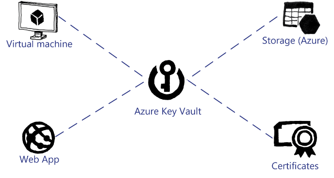

# Usage Scenarios

There are many reasons why you may want to use the features of Key Vault. The table further below lists example scenarios for Key Vault.

|Persona|Scenario|
|---------|---------|
|Developer|An application uses Azure Storage queues to pass data between loosely coupled elements of the application. Because the data contains sensitive information about customers such as credit card numbers, you must ensure the data is secure by encrypting the data. The developers want to use a centralized secret store to utilize keys that they can manage and rotate easily without having to update application code. Another scenario is a company wants to develop an application, where the data stored for each customer is encrypted by using a unique secret to mitigate against data theft. Each customer secret needs to be stored in a location that is accessible to the application through a uniform resource identifier (URI) and can be secured through integration with Azure AD application management.|
|Backup Administrator|Some backup applications utilize certificates for their encryption keys and as certificates expire, they need to be replaced. To ensure that older backups can be restored when required, the Backup Administrator can use Key Vault to store the certificates and extract them if/when required. Another scenario is a company uses Azure Backup combined with Microsoft System Center Data Protection Manager. When integrating the two products, the Backup Administrator must create an encryption passphrase that is used to encrypt and decrypt the data stored in Azure Backup. Key Vault allows the Backup Administrator to store the passphrase in a secure location.|
|Chief Security Officer (CSO)|A company’s CSO wants all secrets, such as passwords, stored in a centralized location so that access to the secrets can be managed and audited. Key Vault maintains logs of all activities performed against secrets and keys.|
|Certificate Administrator|The Certificate Administrators are responsible for maintaining Public Key Infrastructure (PKI) in their organization. The Certificate Administrator needs a location where the root certificates can be stored safely, and away from the infrastructure. Therefore, in case a rebuild of the infrastructure is required, these certificates are available. Key Vault allows the Certificate Administrator to store the required PKI certificates in a secure manner.|
|Cloud Operator|When provisioning resource providers, such as the App Service resource provider for Azure Stack, several usernames, passwords and certificate files are required. To ensure these are stored safely, a Cloud Operator store them in a Key Vault.|