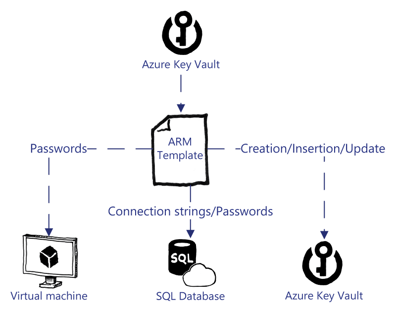
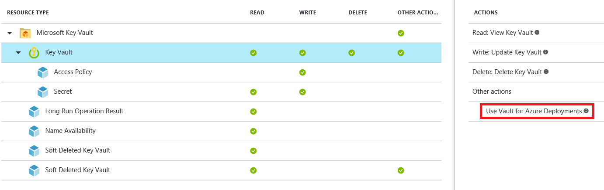

# Using Azure Key Vault with Azure Resource Manager Templates

Key Vault is extremely versatile because you can provision and populate it through Azure Resource Manager templates, if required. You can use the values that are stored in a Key to populate parameters in an Azure Resource Manager Template.

To allow DevOps users to utilize secrets in a Key Vault, you need to give the users the following permission on the Key Vault:

    Microsoft.KeyVault/vaults/deploy/action

This is set at the Key Vault level, and not at the individual secret or key level.

The following screenshot highlights the required permission:

You can use one of the following two methods for using secrets in an Azure Resource Manager Template deployment:

1. Parameters file

2. Linked templates