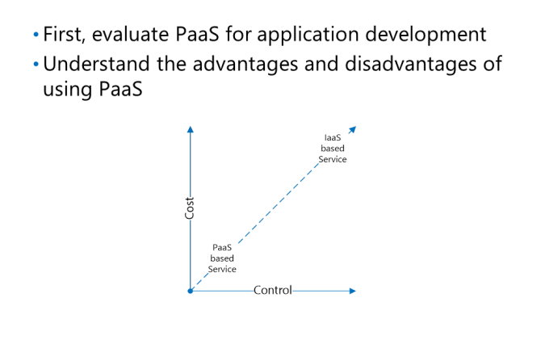

# Choosing Between PaaS and IaaS

Although IaaS offers total control over an environment, the cost of the infrastructure might make the overall solution prohibitively expensive for some organizations to implement. This typically includes maintenance costs that are not readily visible such as application updates, operating system updates, and anti-malware solutions.

For example, with SQL Server databases in Azure, Microsoft offers up to four online readable secondary databases with a highly available architecture. To implement a similar IaaS architecture with SQL Server 2016 Enterprise Edition, you would require a minimum of five SQL Servers in Azure (1 primary, 4 read-only secondary), and premium storage for performance. Although, this gives you a similar underlying infrastructure to a P15 Azure SQL Database, the cost of implementation would be hugely different.
When you are planning to use the PaaS platform, there are some advantages and disadvantages that you should consider. The following table describes these considerations:

|Advantages|Disadvantages|
|---------|---------|
|The total cost of ownership (TCO) can be dramatically lower because the underlying maintenance of the server infrastructure and the application (in cases such as Azure SQL Database) is included in your consumption cost. All users consuming the service pay this cost.|Control over the specific configuration of a PaaS service is typically limited.|
|Automated scaling of resources based on resource consumption enables you to cope with unpredictable resource usage with or without manual intervention.|Application developers need to understand how auto-scaling can affect their application and therefore, it must be designed with auto-scaling in mind.|
|The feature set of PaaS services changes with minimal impact on running services.|The functionality of a PaaS service is typically less than that of an IaaS equivalent. Therefore, some compromises might be required in the application development process.|
|New services/features are available in PaaS platforms.|Transitioning existing applications to a PaaS service can be difficult because the application might rely on features that are not available in the PaaS service.|
|Applications based on IaaS are coupled directly to the underlying operating system and typically are tied to the version of the operating system they were deployed on. PaaS services abstract the underlying operating system ensuring PaaS consumers can use the service without being tied to a particular operating system version.|The application marketplace from Independent Software Vendors (ISVs), who are able to utilize PaaS-based services, is not as mature as traditional IaaS-based services. For example, the number of software vendors who can support Azure SQL Database for database functionality is not as high as the number of ISVs that support IaaS-based SQL Server.|
|If an application were to suddenly grow in its resource usage, PaaS-based applications are much more suited to sudden increases because the Cloud Service Provider offers the underlying infrastructure, such as storage, at a seemingly infinite quantity.|Surges in application resource usage can lead to an unexpected increase in expenditure due to features such as auto-scaling.|

Most applications rely on a component of IaaS to some degree and some applications might have to remain within an IaaS infrastructure for several different reasons, including compliance, security, or other factors. PaaS services are not suitable for every application. However, we recommend, where possible, to fully evaluate PaaS services for applications before deciding whether to use IaaS or PaaS.