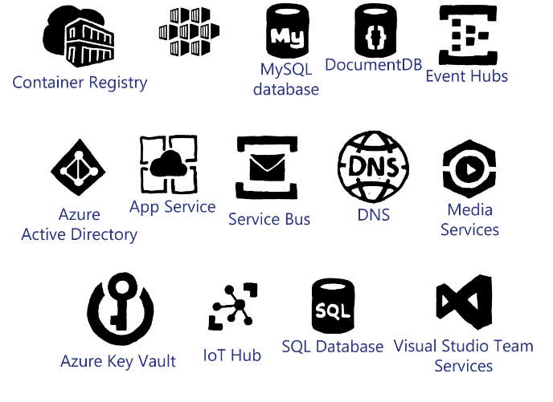

# PaaS Options in Microsoft Azure

Originally, when Microsoft released Azure in 2010, it designed Azure primarily as a PaaS platform that application developers can use to create applications without having to manage the underlying infrastructure too. In April 2013, Microsoft responded to customer demand to add IaaS-based services to Azure by allowing users to create their own virtual machines and virtual networks.

Microsoft has continued to focus on both areas of Azure to ensure that new services that are introduced in Azure can be consumed as a PaaS service, or possibly be delivered by IaaS. The focus by Microsoft is to provide the best possible combination of both categories and to drive application developers to use PaaS services to create applications.

The following list describes some of the most common PaaS services in Azure:

- **SQL Database:** This is a relational database management system (RDBMS) based on Microsoft SQL Server. Application developers can use this to create their own SQL Server-based databases without having to deploy IaaS-based SQL Server virtual machines, whether that SQL Server is running on Windows Server or Linux. Azure SQL Database offers predictable performance across various levels of service within built-in capabilities, which in turn offers near-zero administration for consumers of the service. The service is charged based on the service tier and the number of Database Transaction Units (DTUs) available. For an explanation of DTUs, refer the following website: <https://aka.ms/moc-10995a-pg083>.

- **App Service:** Azure consumers can use the App Service to host web and mobile applications on fully managed Windows Server-based virtual machines. These virtual machines can be dedicated machines or can be shared with other users. You have several options for hosting, ranging from a free service with very limited CPU capacity available for a website to a dedicated instance deployed into a user’s virtual network that is fully managed by Microsoft (also known as an App Service Environment). App Service supports major frameworks such as Microsoft .NET Framework, PHP, Node.js, and many others. Additionally, Microsoft is previewing the App Service based on Linux virtual machines. For more information on App Service, refer to the following website: <https://aka.ms/moc-10995A-pg060>.

- **Key Vault:** This service safeguards user cryptographic keys and secrets. Cloud applications and services use these keys and secrets if required, or use the Key Vault as a location to store other sensitive information. For example, you can store the credentials for an Active Directory Domain Admin account. Key Vault can encrypt keys and secrets such as .PFX files, passwords, and authentication keys. An example secret could be an account password used to join Windows operating systems to an Active Directory domain. This could be referenced in an Azure Resource Manager template parameter file without the provisioning user ever needing to know the actual password. For more information on Key Vault, refer to the following website: <https://aka.ms/moc-10995A-pg061>.

- **Service Fabric:** This is a distributed systems platform that you can use to build reliable microservices. Service Fabric powers various different services in Azure for Microsoft. You can create distributed, scalable, stateless, and stateful microservices. Each service you build can be scaled independently of each other to provide total flexibility. This technology architecture is in use with Azure Stack. For more information on Service Fabric, refer to the following website: <https://aka.ms/moc-10995A-pg062>.

- **Container Services:** This service allows you to create, configure, and manage a cluster of virtual machines that are preconfigured to run containerized applications. It uses the Docker container format, which ensures that your containers are portable. The Container Service supports various management stacks including Marathon and DC/OS, Docker Swarm, or Kubernetes. This allows you to scale your application as required to thousands of containers. For more information on Container Services, refer the following website: <https://aka.ms/moc-10995A-pg063>.

- **Azure Domain Name System (DNS):** Azure DNS can host your DNS domains for you on the global Azure infrastructure. Having the DNS domains in Azure allows you to manage the domains and records by using the available role-based access control (RBAC) methods. This can allow some users to have update privileges, some to have delete privileges, and so on. Because DNS is based on the global Azure infrastructure, the closest available Azure DNS server can respond to the DNS query giving DNS much higher performance and truly global high availability. For more information on Azure DNS, refer to at the following website: <https://aka.ms/moc-10995A-pg064>.

The services listed so far are all PaaS service from Microsoft that you can run in IaaS virtual machines. However, the automation process and other management wrappers would make the cost of implementation on a per user basis very expensive and potentially prohibitive. By using these services as multi-usered solutions, Microsoft can offer these services at a much lower price point. For a full list of available services in Azure, refer to the following website: <https://aka.ms/moc-10995A-pg065>.