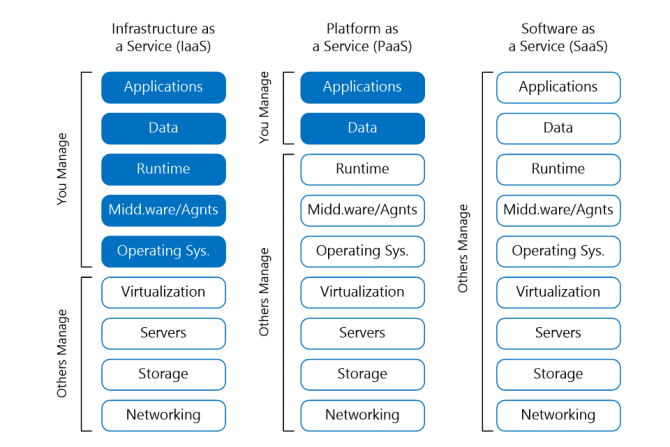

# Understanding Platform as a Service

Apart from providing an Infrastructure as a Service (IaaS) platform, Microsoft Azure Stack also offers several Platform as a Service (PaaS) features similar to Microsoft Azure. Microsoft originally designed Azure for PaaS-based application development and added IaaS-based services. With the initial release of Azure Stack, Microsoft offers four PaaS-based services:

1. Microsoft SQL Server and MySQL databases

2. App Service for websites

3. Key Vault for securely storing secrets such as passwords and certificates

4. Azure Functions for serverless compute

## What is Platform as a Service?

In cloud computing, there are typically three categories of services that a cloud solution provider such as Microsoft offers. In Module 6, "Infrastructure as a Service and Microsoft Azure Stack", you learned about IaaS and what Azure Stack offers in that area.

PaaS is placed in the middle of the three cloud computing categories. It is typically a multiuser platform, where the cloud resource provider manages the underlying infrastructure responsible for delivering the service and multiple users consume the resources providing the service. This removes much of the overhead that is typically incurred in IaaS when delivering applications to end-users.

PaaS services are preformed services that users can consume if the required features are available. By removing the requirement for users to manage the underlying infrastructure, PaaS enables application developers to concentrate on delivering business value. Application developers do not need to concern themselves with how the underlying infrastructure is structured, managed, or maintained.

Because PaaS services are multiuser services, the cloud service provider places constraints to ensure the user’s usage of service does not overwhelm the underlying infrastructure. For example, with a shared database platform the amount of memory, CPU, input/output operations per second (IOPS), and other factors would be limited per user. This ensures that no single user database utilizes all the resources available on the underlying infrastructure, and deprives other users of the available resources.

With PaaS services, cloud service providers typically use three chargeback processes:

1. **Consumption:** The service is charged for the amount of resources that the users consume and use. For example, a web hosting PaaS environment might charge for the amount of CPU and bandwidth consumed by a website but not for the instance of the website. So, when the website is idle, the user is, in effect, does not pay for usage because there is none.

2. **Quota:** The service is charged for what might be consumed by a user. For example, a web-hosting PaaS environment might charge for the amount of CPU and bandwidth that is allocated to a website and for hosting the website. Therefore, when the website is idle, the user pays for the potential usage of their site not the actual usage.

3. **Combination of consumption and quota:** In this process, the cloud service provider charges for both aspects of the website: the amount of resources consumed by the site and the quota it has been allocated on a shared infrastructure. This is the most common chargeback process because cloud service providers want to ensure that the site will perform as required when required and that the consumption of resources such as bandwidth are charged for when used. A cloud service provider would not typically want to allocate over 100% of the available resources because if all the services on the platform were to require their allocated resource quota, then the cloud service provider would not be able to honor the Service Level Agreement (SLA) to which the user subscribed.

PaaS services typically include the ability for the service provided to the user to scale automatically based on a variety of parameters. For example, if the user hosts a website on a PaaS platform and the amount of website traffic suddenly increases, the PaaS platform could scale out the number of servers hosting the website to cope with the additional load and when the amount of website traffic decreases, automatically scale in the number of servers. The user is charged for the additional servers only for the period that they are in use. This can help meet unexpected increases in traffic without the website owner/developer having to manually respond.

Many PaaS services offer similar levels of functionality to IaaS services such as Continual Deployment Integration with code repositories such as GitHub or Visual Studio Team Services. The PaaS platform manages the integration itself without requiring the application developer to manually configure the underlying infrastructure required for the integration.