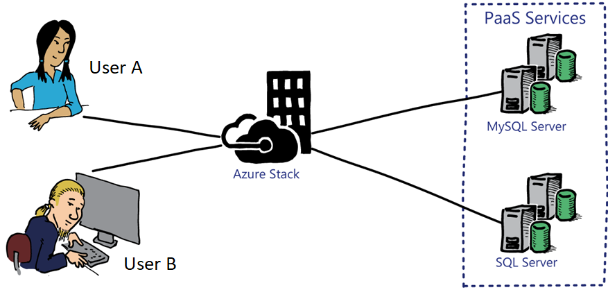

# Configuring Capacity for the MySQL Resource Provider

After installing the MySQL resource provider, you must allocate capacity that will be used when provisioning databases in Azure Stack. To facilitate this, you must either create a new MySQL Server instance, or attach an existing MySQL Server to the MySQL resource provider. Included below are the high-level steps required to perform this task:

1. Sign-in to the Azure Stack Administrator Portal.

2. Navigate to Resource Providers\MySQL Adapter\Hosting Servers.

3. Click Add and then provide the following information:

    - **SQL Server name:** The name of the MySQL Server.

    - **Username:** The user name that will be used by the resource provider to access the MySQL Server.

    - **Password:** The password for the user name specified above.

    - **Size of hosting server in GB:** The amount of database space to allocate.

    - **Subscription:** The Azure Stack Subscription it will be allocated with.

    - **Resource Group:** The Azure Stack Resource Group it will be allocated with.

    - **Location:** The Azure Stack location it will be associated with.

    - **SKU:** To enable different service offerings, you must associate the SQL Server with a SKU that includes information such as Name, Family, Edition and Tier.

4. Click Create.

After completing the steps above, the hosting server is associated with the resource provider. Database can then be provisioned using Azure Stack.

If you need to provision a new MySQL Server virtual machine for use with the MySQL resource provider, refer to the following website which offers guidance on creating highly available MySQL Server deployments in Azure, similar to Azure Stack: <https://aka.ms/moc-10995A-sql1>.

When deploying additional capacity, consider the following factors:

- **Operating system:** Are you going to deploy MySQL Server on Linux or Windows-based virtual machines?

- **High availability of the MySQL Server instance:** How are you going to ensure user databases are highly available?

- **Updating of the virtual machines:** How are you going to update the virtual machine operating systems and MySQL Server instances?

- **AD DS:** If you are going to use Windows-based virtual machines, then you might require an Active Directory domain. Will this be a dedicated domain for the MySQL resource provider or will it use an existing Active Directory domain?

- **Anti-malware:** Are you going to deploy anti-malware on the virtual machines? How will you report on the status?

- **Backup:** Will you take backups of user databases? If so how will you do this?

As mentioned earlier, when you add MySQL Servers to the resource provider, they are known as MySQL hosting servers. Each server is allocated an amount of capacity, specified by the Azure Stack Cloud Operator. When users provision MySQL databases, Azure Stack determines which MySQL Hosting Server in the region has the required capacity, and this server is then used to provision the database.

The following method is one of the possible methods of delivering MySQL Servers for use by Azure Stack users:

