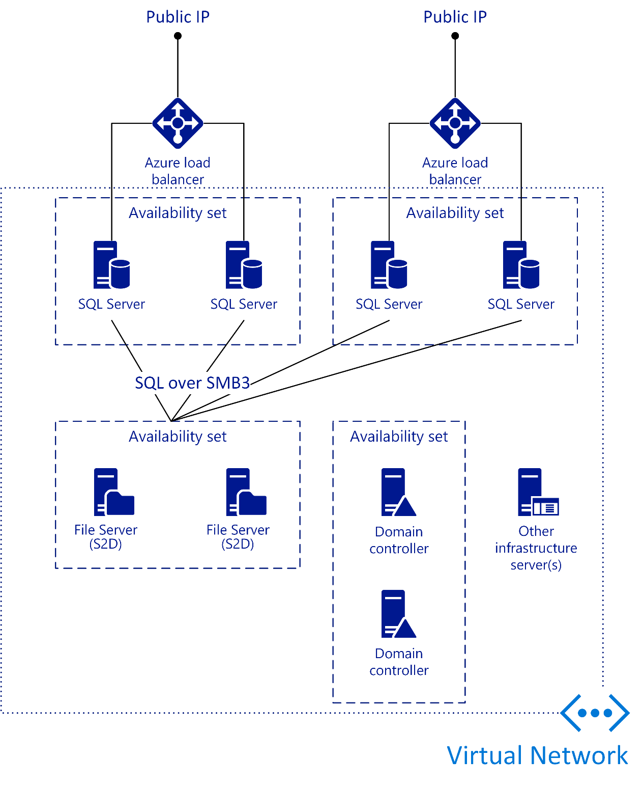

# Configuring Capacity for the SQL Resource Provider

After installing the SQL resource provider, you must allocate capacity that will be used when provisioning databases in Azure Stack. To facilitate this, you must either create a new SQL Server instance, or attach an existing SQL Server to the SQL resource provider. Included below are the high-level steps required to perform this task:

1. Sign-in to the Azure Stack Administrator Portal.

2. Navigate to Resource Providers\SQL Adapter\Hosting Servers.

3. Click Add and then provide the following information:

    - **SQL Server name:** The name of the SQL Server.

    - **Username:** The user name that will be used by the resource provider to access the SQL Server.

    - **Password:** The password for the user name specified above.

    - **Size of hosting server in GB:** The amount of database space to allocate.

    - **Subscription:** The Azure Stack Subscription it will be allocated with.

    - **Resource Group:** The Azure Stack Resource Group it will be allocated with.

    - **Location:** The Azure Stack location it will be associated with.

    - **SKU:** To enable different service offerings, you must associate the SQL Server with a SKU that includes information such as Name, Family, Edition and Tier.

4. Click Create.

After completing the steps above, the hosting server is associated with the resource provider. Database can then be provisioned using Azure Stack.

**Note:** If you need to provision a new SQL Server virtual machine for use with the SQL resource provider, you can use a template available in the GitHub repository to facilitate this that can be found here: <https://aka.ms/moc-10995a-az14>.

When deploying additional capacity, you should consider the following factors:

- **High availability of the SQL Server instance:** How are you going to ensure user databases are highly available?

- **Updating of the virtual machines:** How are you going to update the virtual machine operating systems and the SQL Server instances?

- **AD DS:** If you are going to use AlwaysOn Availability Groups or Failover Clustering, then you may require an Active Directory domain (although this is not a requirement). Will this be a dedicated domain for the SQL resource provider or will it use an existing Active Directory domain?

- **Anti-Malware:** Are you going to deploy anti-malware on the virtual machines? How will you report on the status?

- **Backup:** Will you take backups of the user databases? If so, how will you do this?

As mentioned earlier, when you add SQL Servers to the resource provider, they are known as SQL hosting servers. Each server is allocated an amount of capacity, specified by the Azure Stack Cloud Operator. When the users provision SQL databases, Azure Stack determines which SQL hosting server in the region has the required capacity and this server is then used to provision the database.

The following method is one of the possible methods of delivering SQL Servers for the use by Azure Stack users:

Another Availability Set shows a Storage Spaces Direct (S2D) Cluster. All SQL Servers are connected to this cluster to show that the cluster is using the S2D Cluster for shared storage.

Finally, a third Availability Set with two domain controllers, and an icon representing “Other Infrastructure Servers”. This includes a dedicated Active Directory infrastructure that might be required for the SQL Servers to use high-availability options such as SQL Server Failover Clustering.