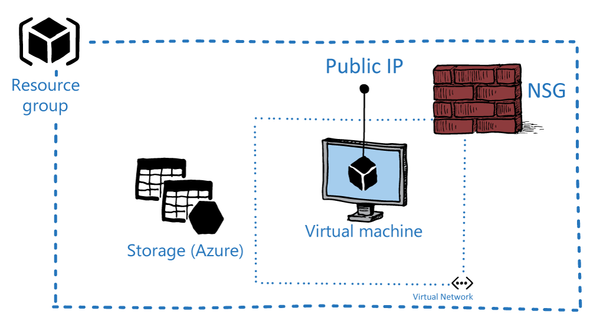

# Installing SQL Server and MySQL Resource Providers

In this lesson, you will learn about the SQL Server and MySQL Server resource providers for Azure Stack. This lesson describes how to install and configure these resource providers. Additionally, you will learn about the requirements that the Azure Stack Cloud Operator must meet to implement these services.

After completing this module you will be able to:

- Install the SQL and MySQL resource provider.

- Configure the SQL and MySQL resource provider.

Azure Stack can offer PaaS services to users. In this topic, you will see how to install the SQL Server and MySQL resource providers into the Azure Stack Development Kit environment.

The SQL Server and MySQL resource providers are not part of the core installation of Azure Stack. They are optional. As an Azure Stack Cloud Architect or Cloud Operator, you can decide whether you want to offer them as a service to your users. The underlying infrastructure for both resource providers, in this case Database Software, is installed on dedicated IaaS-based virtual machines in the Azure Stack environment.

You can decide which Azure Stack Regions will offer what services. For example, if you have two Azure Stack Regions, one in London and another in Paris, you could choose to offer the SQL Resource Provider in just the London Azure Stack region.

You should perform the installation of the resource providers only when the Azure Stack environment is in a healthy state. The following high-level steps show you how to check the Health Status:

1. Sign-in to the Azure Stack Administration portal as an Azure Stack Cloud Operator.

2. Navigate to Region Management.

3. Select the Region you are installing the resource provider into. In the case of the Azure Stack Development Kit environment, it will be the “local” Region.

4. In the Settings blade, review the System Health Tests results.

After you have determined the environment is healthy, you can proceed with the installation.

## Configuring the SQL Server and MySQL Resource Providers

**Note:** The installation of the resource providers does not involve any configuration. Therefore, after you install the resource providers, they are not immediately ready for users to consume them because no capacity has been allocated.